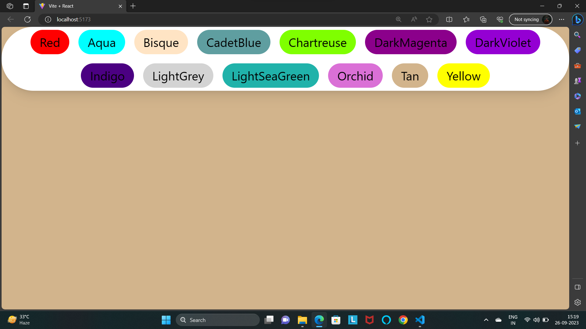

# 6. BG Changer
### App.js
```jsx
import { useState } from "react"


function App() {
  const [color, setColor] = useState("olive");

  return (
	// difine variable in color if backgroundColor
    <div className="w-full h-screen duration-100 " style={{ backgroundColor: color }}>
      <div className="fixed flex flex-wrap justify-center bottom-12 inset-x-0 px-2">
        <div className="fixed flex flex-wrap justify-center gap-3 shadow-lg bg-white px-3 py-1 rounded-full">

          <button className="outline-none px-3 py-1 rounded-full" style={{background: "red"}} onClick={() => setColor("red")}>Red</button>

          {/* onClick it is a pass a call back function not expext a return value as expext a give me a function.
          so expext these if, onClick ={setColor}  this is a pass refrence of function par parameter can't pass them.
          if parameter pass so onClick={setColor("red")} so problem of syntax.
          but, these are directly execute is onClick={setColor("red")} tab fuction jo return value dega vo function me chala jaiga.
          onClick ko sirf function chahiyee.. not retun value them pass
          so pass onClick = { () => setColor("red")} pass as callback function  */}

          <button className="outline-none px-3 py-1 rounded-full" style={{background: "Aqua"}} onClick={() => setColor("Aqua")} >Aqua</button>
          <button className="outline-none px-3 py-1 rounded-full" style={{background: "Bisque"}} onClick={() => setColor("Bisque")}>Bisque</button>
          <button className="outline-none px-3 py-1 rounded-full" style={{background: "CadetBlue"}} onClick={() => setColor("CadetBlue")}>CadetBlue</button>
          <button className="outline-none px-3 py-1 rounded-full" style={{background: "Chartreuse"}} onClick={() => setColor("Chartreuse")}>Chartreuse</button>
          <button className="outline-none px-3 py-1 rounded-full" style={{background: "DarkMagenta"}} onClick={() => setColor("DarkMagenta")}>DarkMagenta</button>
          <button className="outline-none px-3 py-1 rounded-full" style={{background: "DarkViolet"}} onClick={() => setColor("DarkViolet")}>DarkViolet</button>
          <button className="outline-none px-3 py-1 rounded-full" style={{background: "Indigo"}} onClick={() => setColor("Indigo")}>Indigo</button>
          <button className="outline-none px-3 py-1 rounded-full" style={{background: "LightGrey"}} onClick={()=> setColor("Indigo")}>Indigo</button> 
        </div>
      </div>
    </div>
  )
}
export default App

```



## auto Change Background
```jsx 
import { useEffect, useState } from "react";

function App() {
  const [color, setColor] = useState("olive");
  const [autoChange, setAutoChange] = useState(false); // Flag to control automatic color change

  // Function to generate a random color
  const generateRandomColor = () => {
    return '#' + Math.floor(Math.random() * 16777215).toString(16);
  };

  // Function to handle the Start/Stop button click
  const handleToggleClick = () => {
    setAutoChange(!autoChange); // Toggle the autoChange state
  };

  // Use useEffect to change the background color automatically when autoChange is true
  useEffect(() => {
    let intervalId;

    if (autoChange) {
      intervalId = setInterval(() => {
        const randomColor = generateRandomColor();
        setColor(randomColor);
      }, 1000); // Change color every 1000 milliseconds (1 second)
    }

    // Clean up the interval when autoChange is false or when the component unmounts
    return () => 
    clearInterval(intervalId);

  }, [ handleToggleClick]);

  return (

    <div className="w-full h-screen duration-100 " style={{ backgroundColor: color }}>
      <div className="fixed flex flex-wrap justify-center inset-x-0 px-2">
        <div className="fixed flex flex-wrap justify-center gap-3 shadow-lg bg-white px-3 py-1 rounded-full">

          {/* onClick it is a pass a call back function not expext a return value as expext a give me a function.
          so expext these if, onClick ={setColor}  this is a pass refrence of function par parameter can't pass them. 
          if parameter pass so onClick={setColor("red")} so problem of syntax.
          but, these are directly execute is onClick={setColor("red")} tab fuction jo return value dega vo function me chala jaiga.
          onClick ko sirf function chahiyee.. not retun value them pass
          so pass onClick = { () => setColor("red")} pass as callback function  */}

          <button className="outline-none px-3 py-1 rounded-full" style={{background: "red"}} onClick={() => setColor("red")}>Red</button>
          <button className="outline-none px-3 py-1 rounded-full" style={{background: "Aqua"}} onClick={() => setColor("Aqua")} >Aqua</button>
          <button className="outline-none px-3 py-1 rounded-full" style={{background: "Bisque"}} onClick={() => setColor("Bisque")}>Bisque</button>
          <button className="outline-none px-3 py-1 rounded-full" style={{background: "CadetBlue"}} onClick={() => setColor("CadetBlue")}>CadetBlue</button>
          <button className="outline-none px-3 py-1 rounded-full" style={{background: "Chartreuse"}} onClick={() => setColor("Chartreuse")}>Chartreuse</button>
          <button className="outline-none px-3 py-1 rounded-full" style={{background: "DarkMagenta"}} onClick={() => setColor("DarkMagenta")}>DarkMagenta</button>
          <button className="outline-none px-3 py-1 rounded-full" style={{background: "DarkViolet"}} onClick={() => setColor("DarkViolet")}>DarkViolet</button>
          <button className="outline-none px-3 py-1 rounded-full" style={{background: "Indigo"}} onClick={() => setColor("Indigo")}>Indigo</button>
          <button className="outline-none px-3 py-1 rounded-full" style={{background: "LightGrey"}} onClick={() => setColor("LightGrey")}>LightGrey</button>
          <button className="outline-none px-3 py-1 rounded-full" style={{background: "LightSeaGreen"}} onClick={() => setColor("LightSeaGreen")}>LightSeaGreen</button>
          <button className="outline-none px-3 py-1 rounded-full" style={{background: "Orchid"}} onClick={() => setColor("Orchid")}>Orchid</button>
          <button className="outline-none px-3 py-1 rounded-full" style={{background: "Tan"}} onClick={() => setColor("Tan")}>Tan</button>
          <button className="outline-none px-3 py-1 rounded-full" style={{background: "Yellow"}} onClick={() => setColor("Yellow")}>Yellow</button>
          <button className="outline-none px-3 py-1 rounded-full" style={{background: "Yellow"}} onClick={handleToggleClick}>
          {autoChange ? 'Stop' : 'Start'}
          Auto Change</button>

        </div>
      </div>
    </div>
  )
}

export default App

```

