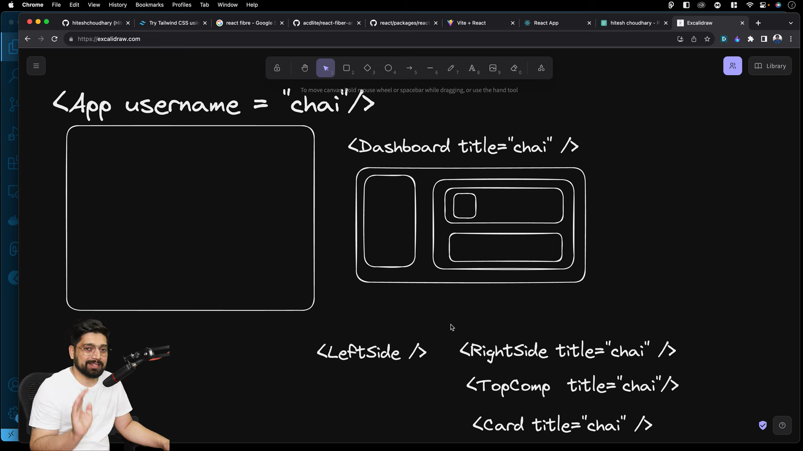
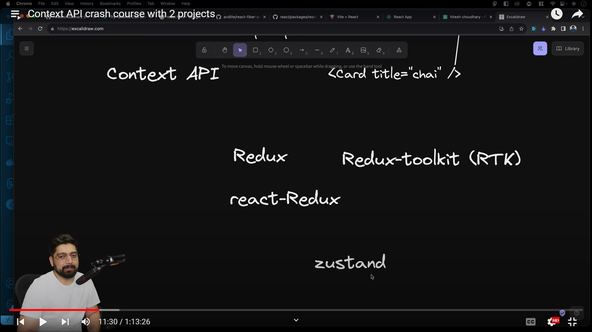

# Contex Api
## Link: https://react.dev/reference/react/useContext






# Project 1 Login And Profile Fetch And Pass Data.
### Step 1. Contex/UserContex.js
- >  // Context ki jo  provider deta - he.... jo ek variable provide karta he
- > // UserConttex 1 Provider he. jis me end me 1 wrapper lagai ge.
- >// as like a,
 ```js
  <UserContex>
         <Login />
         <Card>
             <Data />
         </Card>
    </UserContex> 
```

- > // je se wrape kare ge ban jaiga Provider. jisme jo bhi components he un ko Globle UseContex ka excess mil jai ga.
- >// as a like Contex like a Globle Variabal
- >// jis k sath 1 Provider bhi banana padta he. 
- >// jo Component directly UserComponent K throught sari state ka excess le sakta he.

### Contex/UserContex.js
#
## Step 2 :  Contex/UserContexProvider.jsx

## step 3 : App.js

### step 4 :
### Make components folder
### Login.jsx :  ***How to Data excess***
### Profile.jsx :  ***How to Data send***

#
### Step 5 :
### GO to App.jsx Provode a 2 component jo how to excess data jo hamane component me hi data excess kar diye the..
### jab bhi Data lena ho useConext ko use karo or data fetch kardo.

#
#
# File Code Here
- src
    - Contex
        - UserContex.js
        - UserContexProvider.jsx
    - Components
        - Login.jsx
        - Profile.jsx
    - App.js
#

# Contex/ UserContex.js
```js
import React from 'react'

const UserContex = React.createContext()

export default UserContex;

```
#
# Contex/ UserContexProvider.jsx
```jsx
import React from "react";
import UserContex from "./UserContex";

// UserContexProvider Method.
//  as children like a Login, Signup, Deshbord   
const UserContexProvider = ({children}) => {
    const [user, setUser] = React.useState(null)
    return(
        <UserContex.Provider value={{user, setUser}}>
            {children}
        </UserContex.Provider>
    )
}
export default UserContexProvider;
```
#


#

# Components/ Login.jsx : ***How to Data excess***
```jsx
import React, { useState, useContext } from 'react'
import UserContex from '../Contex/UserContex'


function Login() {
    
    // step 2
    // make state 
    // controll state value in inputs.
    // if field change then onChange Given.
    const [username, setUsername] = useState('') 
    const [password, setPassword] = useState('')
    
    // step 3 
    // How to fetch Value of UserContex. help for useContex.
    //see UserContexProvider Which declered setData.
    const {setUser} = useContext(UserContex);

    // step 1
    // build Method 
    const handleSubmit = (e) => {
        e.preventDefault() // if not declered then by default value URL throught chali gati he. ye Post Method k throught chalijai he.
        setUser({username, password})

    }
  return (
    <div>
        <h2>Login</h2>
        <input
        value={username}
        onChange={(e) => setUsername(e.target.value) }
        type="text"
        placeholder='usename'
        />
        {" "}
        <input 
        value={password}
        onChange={(e) => setPassword(e.target.value) }
        type="text" 
        placeholder='password' />
        <button onClick={handleSubmit}>Submit</button>
    </div>
  )
}

export default Login
```
#
# Component/ Profile.jsx :  ***How to Data send***
```jsx
import React, {useContext} from 'react'
import UserContex from '../Contex/UserContex'

function Profile() {
    const {user} = useContext(UserContex);

    if (!user) return <div>Please login</div>

    return <div> Welcomme : {user.username}</div>
  
}

export default Profile
```
#
# App.jsx
```jsx
import React from 'react'
import UserContexProvider from './Contex/UserContexProvider'
import Login from './Components/Login'
import Profile from './Components/Profile'

function App() {
  return (
    <UserContexProvider>
      <h1>React with Contex Api</h1>
      <Login />
      <Profile />
    </UserContexProvider>
  )
}

export default App
```
#
# RESULT


