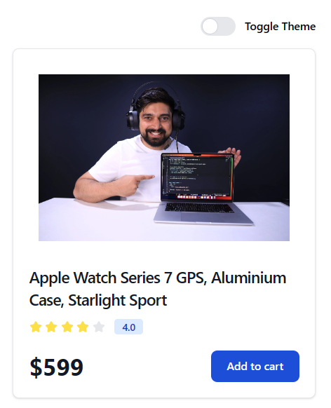
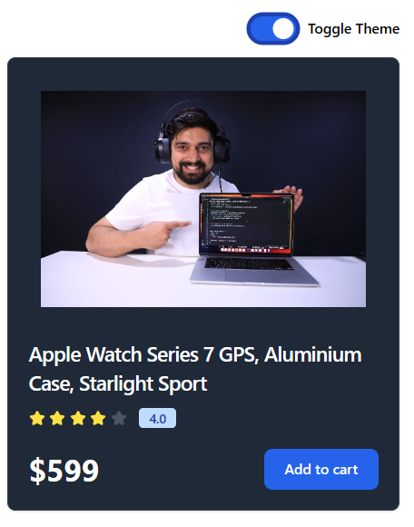

# Contex Api Project 2: Theme Switcher
## Steps Following
- ### Step 1 : Make Contex Folder src/ Contex/ Them.js   
- ### Step 2 : Update src/ App.jsx
- ### Step 3 : Make Componet Folder src/ Component/ 
    - ThemBtn.jsx
    - Card.jsx
- ### Step 4 : Import Components In App.js

#
 # Step 1 : src/ Contex/ Them.js 
### Make Contex Folder src/ Contex/ Them.js 
  ```js
  // step 1
import { createContext, useContext } from "react";

// step 2
export const ThemeContex = createContext({
    // prop 
    themeMode : "light",  
    // Method 
    darkTheme : () => {},
    lightTheme : () => {},
})

// step 3
// Provider
export const ThemeProvider = ThemeContex.Provider

// step 4
export default function useTheme() {
    return useContext(ThemeContex)
}
```
#
 # Step 2 : src/ App.jsx
- ### Step 2 : Update src/ App.js
```jsx
import React, { useEffect, useState } from 'react'
import { ThemeProvider } from './Contex/Them'
import ThemeBtn from './Components/ThemBtn'
import Card from './Components/Card'


function App() {
  // step 2
  const [themeMode, setThemMode] = useState("light")
 
 
  // darkMode and lightMode ko define kiya pr usme value to define nahi ki thi themeMode.js me 
  // so solution is functionally  k name ka hi Method bana lo like a ,

  // step 3
  const lightTheme = () => {
    setThemMode("light")
  }
  const darkTheme = () => {
    setThemMode("dark")
    
  }

  // step 4
  // actual change theme.

    // this is basic concept of js iska koi vastta nahi he contexApi se..
  useEffect(() => {
    document.querySelector('html').classList.remove("light","dark")
    document.querySelector('html').classList.add(themeMode)

  },[themeMode])


  return (
  
    // step 1
    <ThemeProvider value={{themeMode, darkTheme, lightTheme}}>
      <div className="flex flex-wrap min-h-screen items-center">
        <div className="w-full">
          <div className="w-full max-w-sm mx-auto flex justify-end mb-4">
            <ThemeBtn />
          </div>

          <div className="w-full max-w-sm mx-auto">
            <Card />
          </div>
        </div>
      </div>

    </ThemeProvider>
    


  )
}

export default App
```
#
 # Step 3 : Make Componet Folder src/ Component/ 
## ThemBtn.jsx
```jsx
    import React from 'react'
import useTheme from '../Contex/Them';

export default function ThemeBtn() {
    // step 2
   const {themeMode, lightTheme, darkTheme} = useTheme()
   
   // step 3
   const onChangeBtn = (e) => { 
    const darkModeStatus = e.currentTarget.checked

    // step 4
    if (darkModeStatus) {
        darkTheme()
    } else {
        lightTheme()
    }
   }

    return (
        <label className="relative inline-flex items-center cursor-pointer">
           {/* step 1 */}
            <input
                type="checkbox"
                value=""
                className="sr-only peer"
                onChange={onChangeBtn}
                checked = {themeMode === "dark"}
            />
            <div className="w-11 h-6 bg-gray-200 peer-focus:outline-none peer-focus:ring-4 peer-focus:ring-blue-300 dark:peer-focus:ring-blue-800 rounded-full peer dark:bg-gray-700 peer-checked:after:translate-x-full peer-checked:after:border-white after:content-[''] after:absolute after:top-[2px] after:left-[2px] after:bg-white after:border-gray-300 after:border after:rounded-full after:h-5 after:w-5 after:transition-all dark:border-gray-600 peer-checked:bg-blue-600"></div>
            <span className="ml-3 text-sm font-medium text-white-900">Toggle Theme</span>
        </label>
    );
}


```
#
## Card.jsx
```jsx
import React from "react";

export default function Card() {
    return (
        <div className="w-full bg-white border border-gray-200 rounded-lg shadow dark:bg-gray-800 dark:border-gray-700">
            <a href="/">
                
            </a>
            <div className="px-5 pb-5">
                <a href="/">
                    <h5 className="text-xl font-semibold tracking-tight text-gray-900 dark:text-white">
                        Apple Watch Series 7 GPS, Aluminium Case, Starlight Sport
                    </h5>
                </a>
                <div className="flex items-center mt-2.5 mb-5">
                    <svg
                        className="w-4 h-4 text-yellow-300 mr-1"
                        aria-hidden="true"
                        xmlns="http://www.w3.org/2000/svg"
                        fill="currentColor"
                        viewBox="0 0 22 20"
                    >
                        <path d="M20.924 7.625a1.523 1.523 0 0 0-1.238-1.044l-5.051-.734-2.259-4.577a1.534 1.534 0 0 0-2.752 0L7.365 5.847l-5.051.734A1.535 1.535 0 0 0 1.463 9.2l3.656 3.563-.863 5.031a1.532 1.532 0 0 0 2.226 1.616L11 17.033l4.518 2.375a1.534 1.534 0 0 0 2.226-1.617l-.863-5.03L20.537 9.2a1.523 1.523 0 0 0 .387-1.575Z" />
                    </svg>
                    <svg
                        className="w-4 h-4 text-yellow-300 mr-1"
                        aria-hidden="true"
                        xmlns="http://www.w3.org/2000/svg"
                        fill="currentColor"
                        viewBox="0 0 22 20"
                    >
                        <path d="M20.924 7.625a1.523 1.523 0 0 0-1.238-1.044l-5.051-.734-2.259-4.577a1.534 1.534 0 0 0-2.752 0L7.365 5.847l-5.051.734A1.535 1.535 0 0 0 1.463 9.2l3.656 3.563-.863 5.031a1.532 1.532 0 0 0 2.226 1.616L11 17.033l4.518 2.375a1.534 1.534 0 0 0 2.226-1.617l-.863-5.03L20.537 9.2a1.523 1.523 0 0 0 .387-1.575Z" />
                    </svg>
                    <svg
                        className="w-4 h-4 text-yellow-300 mr-1"
                        aria-hidden="true"
                        xmlns="http://www.w3.org/2000/svg"
                        fill="currentColor"
                        viewBox="0 0 22 20"
                    >
                        <path d="M20.924 7.625a1.523 1.523 0 0 0-1.238-1.044l-5.051-.734-2.259-4.577a1.534 1.534 0 0 0-2.752 0L7.365 5.847l-5.051.734A1.535 1.535 0 0 0 1.463 9.2l3.656 3.563-.863 5.031a1.532 1.532 0 0 0 2.226 1.616L11 17.033l4.518 2.375a1.534 1.534 0 0 0 2.226-1.617l-.863-5.03L20.537 9.2a1.523 1.523 0 0 0 .387-1.575Z" />
                    </svg>
                    <svg
                        className="w-4 h-4 text-yellow-300 mr-1"
                        aria-hidden="true"
                        xmlns="http://www.w3.org/2000/svg"
                        fill="currentColor"
                        viewBox="0 0 22 20"
                    >
                        <path d="M20.924 7.625a1.523 1.523 0 0 0-1.238-1.044l-5.051-.734-2.259-4.577a1.534 1.534 0 0 0-2.752 0L7.365 5.847l-5.051.734A1.535 1.535 0 0 0 1.463 9.2l3.656 3.563-.863 5.031a1.532 1.532 0 0 0 2.226 1.616L11 17.033l4.518 2.375a1.534 1.534 0 0 0 2.226-1.617l-.863-5.03L20.537 9.2a1.523 1.523 0 0 0 .387-1.575Z" />
                    </svg>
                    <svg
                        className="w-4 h-4 text-gray-200 dark:text-gray-600"
                        aria-hidden="true"
                        xmlns="http://www.w3.org/2000/svg"
                        fill="currentColor"
                        viewBox="0 0 22 20"
                    >
                        <path d="M20.924 7.625a1.523 1.523 0 0 0-1.238-1.044l-5.051-.734-2.259-4.577a1.534 1.534 0 0 0-2.752 0L7.365 5.847l-5.051.734A1.535 1.535 0 0 0 1.463 9.2l3.656 3.563-.863 5.031a1.532 1.532 0 0 0 2.226 1.616L11 17.033l4.518 2.375a1.534 1.534 0 0 0 2.226-1.617l-.863-5.03L20.537 9.2a1.523 1.523 0 0 0 .387-1.575Z" />
                    </svg>
                    <span className="bg-blue-100 text-blue-800 text-xs font-semibold mr-2 px-2.5 py-0.5 rounded dark:bg-blue-200 dark:text-blue-800 ml-3">
                        4.0
                    </span>
                </div>
                <div className="flex items-center justify-between">
                    <span className="text-3xl font-bold text-gray-900 dark:text-white">$599</span>
                    <a
                        href="/"
                        className="text-white bg-blue-700 hover:bg-blue-800 focus:ring-4 focus:outline-none focus:ring-blue-300 font-medium rounded-lg text-sm px-5 py-2.5 text-center dark:bg-blue-600 dark:hover:bg-blue-700 dark:focus:ring-blue-800"
                    >
                        Add to cart
                    </a>
                </div>
            </div>
        </div>
    );
}

```
# Step 4 : Import Components In App.jsx
> # Go to top Step 2

#
# Note : Problem Solve in Tailwind.config.js

```jsx
/** @type {import('tailwindcss').Config} */
export default {
  content: [
    "./index.html",
    "./src/**/*.{js,ts,jsx,tsx}",
  ],
  // it changes, so solve Problem
  darkMode: "class",
  theme: {
    extend: {},
  },
  plugins: [],
}

```

