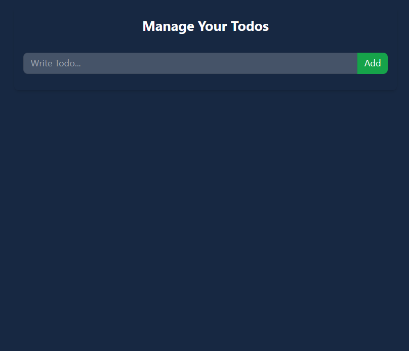
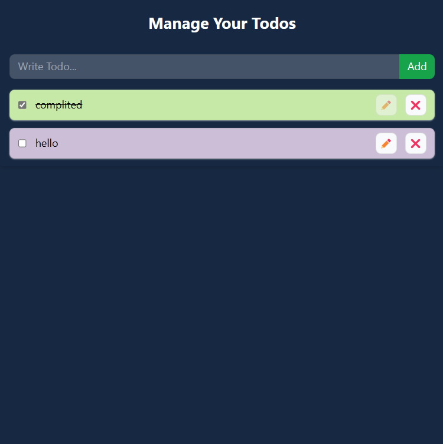
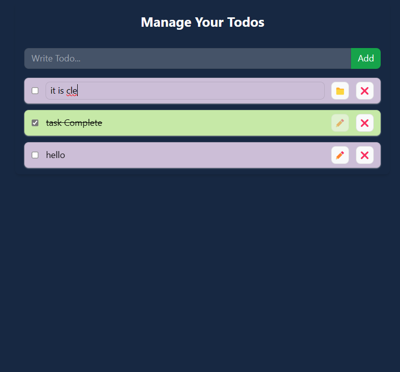
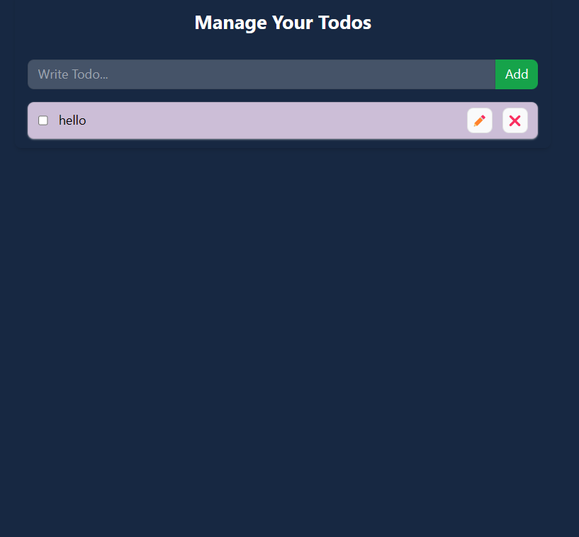

# Todo With Contex store local
#
# step Follows for file Formate :
### step 1 : Make Folder src/ context
- ###  index.js
- ### TodoContext.js

### step 2 : Update File src/ App.js
### step 3 : Make Folder src/ components
- ###  index.js
- ### TodoForm.js 
- ### TodoIteam.js 

#
 # Code

## step 1:  src/ context/ TodoContext.js
```jsx
// step 1
import { createContext, useContext } from 'react'
// step 2
export const TodoContext = createContext({
    // step 5
    todos: [], //properties
    addTodo: (todo) => { }, // Functionality
    updateTodo: (id, todo) => { },
    deleteTodo: (id) => { },
    toggleComplete: (id) => { }
})

// step 3
export const useTodo = () => {
    return useContext(TodoContext)
}

// step 4
export const TodoProvider = TodoContext.Provider

// step 1
/* The `import {createContext, useContext} from 'react'` statement is importing the `createContext` and
`useContext` functions from the 'react' library. These functions are used to create and use a
context in a React application. */

// step 2
/* The code `export const TodoContext = createContext({...})` is creating a context object called
`TodoContext` using the `createContext` function from the 'react' library. */

// step 3
/**
 * The function exports a custom hook called useTodo that returns the value of the TodoContext.
 *
 * Returns:
 *   The `useTodo` function is returning the result of calling the `useContext` hook with the
 * `TodoContext` as an argument.
 */
/* The `return useContext(TodoContext)` statement is returning the value of the `TodoContext`
  object. This allows components that use the `useTodo` hook to access the state and functionality
  defined in the `TodoContext`. */

// step 4
/* `export const TodoProvider = TodoContext.Provider` is exporting a variable called `Todoprovider`
that contains the `Provider` component of the `TodoContext`. */

// step 5
/* The code `todos: [], addTodo: (todo) => {}, updateTodo : (id, todo) => {}, deleteTodo : (id)
       => {}, toggleComplete : (id) => {}` is defining the initial state and functionality of the
       `TodoContext` object. */
// remember
// todos: [
//     {
//         id : 1,
//         todo : "Todo msg",
//         completed : false,
//     }
// ],
```

 ##  index.js
 ```jsx
 export { TodoContext, TodoProvider, useTodo } from "./TodoContext"


/* The line `export {TodoContext, TodoProvider, useTodo} from "./TodoContext"` is exporting the
`TodoContext`, `TodoProvider`, and `useTodo` from the file `TodoContext.js`. This allows other files
to import and use these variables and functions. */
 ```
#

## step 2 : Update File src/ App.js
```jsx
import { useEffect, useState } from 'react'
import './App.css'
import { TodoProvider } from './context/TodoContext'
import TodoForm from './components/TodoForm'
import TodoItem from './components/TodoItem'

function App() {
  // step 2
   const [todos, setTodos] = useState([])

  //  step 3 Method
  const addTodo = (todo) => { 
    setTodos( (prev) => [{id :  Date.now(), ...todo}, ...prev] )  // step 4
  }

  // step 5 Method
  const updateTodo = (id, todo) => {
    setTodos((prev) => prev.map( (prevTodo) => (prevTodo.id === id ? todo : prevTodo)) ) // step 6
  }

  // step 7
  const deleteTodo = (id) => {
    setTodos( (prev) => prev.filter((todo) => todo.id !== id) ) // step 8
  }

  //step 9
  const toggleComplete = (id) => {
    setTodos( (prev) => prev.map((prevTodo) => prevTodo.id === id ? {...prevTodo, completed: !prevTodo.completed} :  prevTodo ) ) //step 10
  }

  // step 11 local storage
  useEffect(() => {
    // step 12
   const todos =JSON.parse(localStorage.getItem("todos"))
   if (todos && todos.length > 0) {
    setTodos(todos)
   } 
  },[])

  // step 13
  useEffect( () => {
    // step 14
    localStorage.setItem("todos", JSON.stringify(todos))
  } ,[todos])


 
  return (
    // step 1
    <TodoProvider value= {{todos, addTodo, updateTodo, deleteTodo, toggleComplete}}>
    <div className="bg-[#172842] min-h-screen py-8">
                <div className="w-full max-w-2xl mx-auto shadow-md rounded-lg px-4 py-3 text-white">
                    <h1 className="text-2xl font-bold text-center mb-8 mt-2">Manage Your Todos</h1>
                    <div className="mb-4">
                        {/* Todo form goes here */} 
                        <TodoForm />
                    </div>
                    <div className="flex flex-wrap gap-y-3">
                        {/*Loop and Add TodoItem here */}
                       
                        {
                          todos.map( (todo) => (
                            <div key ={todo.id}
                            className='w-full'
                            >
                              <TodoItem todo={todo} />
                            </div>
                          ))
                        }
                    </div>
                </div>
            </div>
    </TodoProvider>
  )
}

export default App

// step 1
 /* `const [Todos, setTodos] = useState([])` is a React Hook that initializes a state variable called `Todos` and a function called `setTodos` to update the state variable. The initial value of `Todos` is an empty array `[]`. This hook is used to manage the state of the todos in the application. */

   // step 2
   /* `const [todos, setTodos] = useState([])` is a React Hook that initializes a state variable called `todos` and a function called `setTodos` to update the state variable. The initial value of `todos` is an empty array `[]`. This hook is used to manage the state of the todos in the application. */

  //  step 3
   /**
   * The addTodo function adds a new todo item to the existing list of todos.
   */

   // step 4
    /* `setTodos( (prev) => [{id :  Date.now(), ...todo}, ...prev] )` is updating the state variable `todos` with a new array of todos. */

      // step 5 Method
  /**
   * The function `updatedTodo` updates a specific todo item in a list of todos based on its id.
   */

   // step 6
    /* `setTodos((prev) => prev.map( (prevTodo) => (prevTodo.id === id ? todo : prevTodo)) )` is updating the state variable `todos` by mapping over the previous array of todos and replacing the todo item with the specified `id` with the updated `todo` item. It checks if the `id` o   each todo item matches the specified `id`, and if it does, it replaces it with the update `todo` item. If the `id` does not match, it keeps the original todo item unchanged. * 

     // step 7
  /**
   * The deleteTodo function filters out the todo with the specified id from the todos array.
   */

      // step 8
    /* `setTodos( (prev) => prev.filter((todo) => todo.id !== id) )` is updating the state variable `todos` by filtering out the todo with  the specified `id` from the array of todos. It creates a  new array that only includes the todos whose `id` does not match the specified `id`, effectively  removing the todo with the specified `id` from the list of todos. */

    //step 9
 /**
  * The function `toggleCompleted` updates the `completed` property of a todo item with the given `id`
  * to its opposite value.
  */

  // step 10
   /* `setTodos( (prev) => prev.map((prevTodo) => prevTodo.id === id ? {...prevTodo, completed:  !prevTodo.completed} :  prevTodo ) )` is updating the state variable `todos` by mapping over the  previous array of todos and updating the `completed` property of the todo item with the specified `id` to its opposite value. */

  // step 11
   // syntax 
   //   localStorage.setItem("lastname", "Smith");
   // localStorage.getItem("lastname");

  /* The `useEffect` hook is used to perform side effects in a React component. In this case, the `useEffect` hook is used to load the todos from the local storage when the component mounts. */

  // step 12
   /* This code is retrieving the todos from the local storage using the `localStorage.getItem()` method. It then parses the retrieved data using `JSON.parse()` to convert it from a string to an array. */

   // step 13
/* The `useEffect` hook is used to save the todos to the local storage whenever the `todos` state variable changes. */

    // step 14
  /* The code `localStorage.setTodos("todos", JSON.stringify(todos))` is attempting to save the `todos` array to the local storage. However, there is a mistake in the code. The correct method to save data to the local storage is `localStorage.setItem()`, not `localStorage.setTodos()`. */

 /* This code is mapping over the `todos` array and rendering a `TodoItem`
component for each todo item in the array. The `key` prop is set to the `id`
of each todo item to ensure uniqueness. The `className` prop is set to
 `'w-full'` to apply a CSS class to each `TodoItem` component. The `todo`
prop is passed to the `TodoItem` component to provide the data for each todo item. */
                        
```
#
# step 3 : Make Folder src/ components
### TodoForm.js 
```jsx
// step 1

import React, { useState } from 'react'
import { useTodo } from '../context';

// step 3
function TodoForm() {
    // step 4
    const [todo, setTodo] = useState("")
    const { addTodo } = useTodo()

    // step 5
    const add = (e) => {
        e.preventDefault()

        if (!todo) return
        addTodo({ todo, completed: false })
        setTodo("")
    }

    return (
        // step 2
        /* The code is creating a form element with an input field and a button. */
        <form
            onSubmit={add}
            className="flex"
        >
            <input
                type="text"
                placeholder="Write Todo..."
                className="w-full border border-black/10 rounded-l-lg px-3 outline-none duration-150 bg-white/20 py-1.5"
                value={todo}
                onChange={(e) => setTodo(e.target.value)}
            />
            <button
                type="submit"
                className="rounded-r-lg px-3 py-1 bg-green-600 text-white shrink-0"
            >
                Add
            </button>
        </form>
    );
}
export default TodoForm;

// step 1
/* The code is importing the `React` library and two specific hooks from the `react` package: `useState` and `useTodo`. */

// step 3
/**
 * The TodoForm component is a form that allows users to input and add new todos.
 *
 * Returns:
 *   The TodoForm component is returning a form element with an input field and a button.
 */

// step 4
/* `const [todo, setTodo] = useState("")` is using the `useState` hook to create a state variable
called `todo` and a corresponding setter function called `setTodo`. The initial value of `todo`
is set to an empty string `""`. */

// step 5
/**
 * The function "add" is used to add a new todo item to a list of todos.
 * Returns: The function `add` is not returning anything. It is a void function.
 */

/* `onSubmit={add}` is assigning the `add` function as the event handler for the form's
submit event. When the form is submitted (e.g., by pressing the Enter key or clicking
the submit button), the `add` function will be called. */

/* The `value={todo}` attribute is binding the value of the input field to the `todo`
   state variable. This means that the value displayed in the input field will always
    be the current value of `todo`. */
```
#
### TodoIteam.js 
```jsx
import React, { useState } from 'react'
import { useTodo } from '../context';

// step 1

function TodoItem({ todo }) {
    // step 2
  const [isTodoEditable, setIsTodoEditable] = useState(false)
  const [todoMsg, setTodoMsg] = useState(todo.todo)

//   step 3
  const {updateTodo,deleteTodo, toggleComplete} =  useTodo()

//   step 4
  const editTodo = () => {
    updateTodo(
        todo.id, 
        {...todo, todo: todoMsg}
        )
    setIsTodoEditable(false)
  }

//   step 5
  const toggleCompleted = () => {
    toggleComplete(todo.id)
  }

  return (
      <div
          className={`flex border border-black/10 rounded-lg px-3 py-1.5 gap-x-3 shadow-sm shadow-white/50 duration-300  text-black ${
              todo.completed ? "bg-[#c6e9a7]" : "bg-[#ccbed7]"
          }`}
      >
          <input
              type="checkbox"
              className="cursor-pointer"
              checked={todo.completed}
              onChange={toggleCompleted}
          />
          <input
              type="text"
              className={`border outline-none w-full bg-transparent rounded-lg ${
                  isTodoEditable ? "border-black/10 px-2" : "border-transparent"
              } ${todo.completed ? "line-through" : ""}`}
              value={todoMsg}
              onChange={(e) => setTodoMsg(e.target.value)}
              readOnly={!isTodoEditable}
          />
          {/* Edit, Save Button */}
          <button
              className="inline-flex w-8 h-8 rounded-lg text-sm border border-black/10 justify-center items-center bg-gray-50 hover:bg-gray-100 shrink-0 disabled:opacity-50"
              onClick={() => {
                  if (todo.completed) return;

                  if (isTodoEditable) {
                      editTodo();
                  } else setIsTodoEditable((prev) => !prev);
              }}
              disabled={todo.completed}
          >
              {isTodoEditable ? "📁" : "✏️"}
          </button>
          {/* Delete Todo Button */}
          <button
              className="inline-flex w-8 h-8 rounded-lg text-sm border border-black/10 justify-center items-center bg-gray-50 hover:bg-gray-100 shrink-0"
              onClick={() => deleteTodo(todo.id)}
          >
              ❌
          </button>
      </div>
  );
}

export default TodoItem;


// step 1
/* The code is defining a functional component called `TodoItem`. This component takes a prop called
`todo` which is an object containing information about a todo item. */

    // step 2
/* The code is using the `useState` hook to define two state variables: `isTodoEditable` and `todoMsg`. */
/* The code is using the `useState` hook to define two state variables: `todoMsg` and `setTodoMsg`. */

//   step 3
 /* The line `const {updateTodo,deleteTodo, toggleComplete} =  useTodo()` is using the `useTodo` hook
 to destructure and assign the values returned by the hook to the variables `updateTodo`,
 `deleteTodo`, and `toggleComplete`. These variables are likely functions or methods provided by the
 `useTodo` hook that can be used to update, delete, or toggle the completion status of a todo item. */

//   step 4
  /**
   * The editTodo function updates a todo item with a new message and sets the todo as not editable.
   */
    /* The code `updateTodo(todo.id, {...todo, todo: todoMsg})` is calling the `updateTodo` function
    with three arguments: `todo.id`, `{...todo, todo: todoMsg}`, and `setIsTodoEditable(false)`. */
 
    /* `todo.id` is accessing the `id` property of the `todo` object. It is used as an argument in
the `updateTodo`, `toggleComplete`, and `deleteTodo` functions to identify the specific todo
item that needs to be updated, toggled, or deleted. */

/* `{...todo, todo: todoMsg}` is creating a new object by spreading the properties of the
        `todo` object and overriding the `todo` property with the value of `todoMsg`. */

/* `setIsTodoEditable(false)` is a function call that updates the state variable `isTodoEditable` to
   `false`. This means that it sets the todo item as not editable. */


//   step 5
  /**
   * The function `toggleCompleted` toggles the completion status of a todo item.
   */
/* The `toggleComplete(todo.id)` function is calling a function provided by the `useTodo` hook to
toggle the completion status of a todo item. It takes the `id` of the todo item as an argument
    to identify the specific item that needs to be toggled. */
```
#
###  index.js
```jsx
/* This code is importing the `TodoForm` and `TodoItem` components from their respective files
(`TodoForm.js` and `TodoItem.js`). It then exports these components as named exports using the
`export {TodoItem, TodoForm}` syntax. This allows other files to import and use these components. */

import TodoForm from "./TodoForm";
import TodoItem from "./TodoItem";

export {TodoItem, TodoForm} 
```

# RESULT





