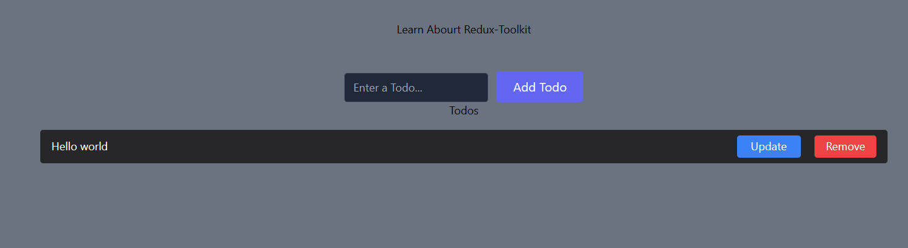
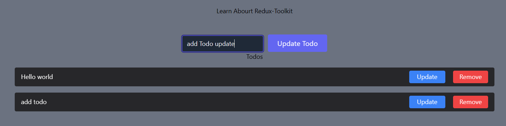
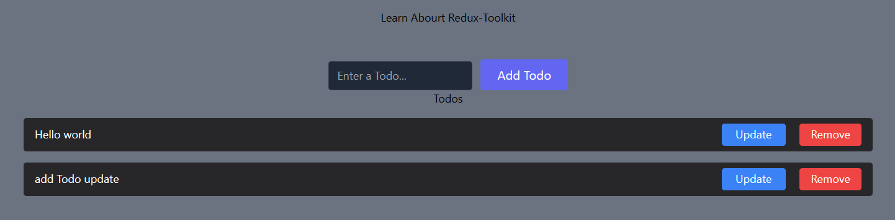

# Redux Toolkit
## Link : https://redux-toolkit.js.org/

## Installation setup
### Link : https://redux-toolkit.js.org/introduction/getting-started

#
## What's Included
### Redux Toolkit includes these APIs:

- > configureStore(): wraps createStore to provide simplified configuration options and good defaults. It can automatically combine your slice reducers, adds whatever Redux middleware you supply, includes redux-thunk by default, and enables use of the Redux DevTools Extension.

- >createReducer(): that lets you supply a lookup table of action types to case reducer functions, rather than writing switch statements. In addition, it automatically uses the immer library to let you write simpler immutable updates with normal mutative code, like state.todos[3].completed = true.

- > createAction(): generates an action creator function for the given action type string. The function itself has toString() defined, so that it can be used in place of the type constant.

- > createSlice(): accepts an object of reducer functions, a slice name, and an initial state value, and automatically generates a slice reducer with corresponding action creators and action types.

- > createAsyncThunk: accepts an action type string and a function that returns a promise, and generates a thunk that dispatches pending/fulfilled/rejected action types based on that promise

- > createEntityAdapter: generates a set of reusable reducers and selectors to manage normalized data in the store
The createSelector utility from the Reselect library, re-exported for ease of use.

#
# Project Start

# React- Redux, Redux Toolkit

#
# step Follows for file Formate :
### step 1 : Make Folder src/ app
- ###  store.js

### step 2 : Make Folder src/ Features / Todo
- ###  TodoSlices.js

### step 3 : Make Folder src/ components
- ### AddTodo.jsx 
- ### Todo.jsx 

### step 4 : Update File src/ App.js
#

### step 1 : Make Folder src/ app
- ###  store.js
```jsx
// step 1
import {configureStore} from '@reduxjs/toolkit'
// step 3
import todoReducer from '../features/Todo/TodoSlice'

// step 2
export  const store = configureStore({
    reducer: todoReducer  // step 4
})

// step 1
/* The line `import {configureStore} from '@reduxjs/toolkit'` is importing the `configureStore`
function from the `@reduxjs/toolkit` package. This function is used to create a Redux store with a
set of default middleware and configuration options. */

// step 2
/* The code `export const store = configureStore({ reducer: todoReducer })` is creating a Redux store
using the `configureStore` function from the `@reduxjs/toolkit` package. The `configureStore`
function takes an object as an argument, with the `reducer` property specifying the reducer function
to be used for managing the state of the application. In this case, the `todoReducer` function is
being used as the reducer. The created store is then exported as `store` using the `export` keyword,
making it accessible to other parts of the application. */

// step 3
/* The line `import todoReducer from '../features/Todo/TodoSlice'` is importing the `todoReducer`
function from the `../features/Todo/TodoSlice` file. This `todoReducer` function is responsible for
defining the state and handling actions related to the Todo feature in the application. */

// step 4
/* The `reducer: todoReducer` line is specifying the reducer function to be used for managing the
state of the application in the Redux store. In this case, the `todoReducer` function is being
used as the reducer. The reducer function is responsible for defining the initial state of the
application and handling actions that modify the state. */

```

### step 2 : Make Folder src/ Features / Todo
- ###  TodoSlices.js
```jsx
// step 1
import { createSlice, nanoid } from "@reduxjs/toolkit";

// step 2
const initialState ={
    todos: [{id:1, text: "Hello world"}],
    edit: {id: null, text: null}
}

// reducer is a one type of Functonality
// step 3
export const todoSlice = createSlice({
    // step 4
    name: 'todo',
    initialState,
    reducers: {
        // step 5
        addTodo: (state, action) => {
            const todo = {
                id: nanoid(),
                
                text: action.payload
            }
            state.todos.push(todo)
        },
        removeTodo: (state, action) => {
            state.todos = state.todos.filter((todo) => todo.id !== action.payload)
        },
        updateTodo: (state, action) => {
            state.todos = state.todos.map((todo) => {
                if(action.payload.id === todo.id){
                    todo.text = action.payload.text
                }
                return todo
            } )            
            state.edit = {id:null, text:null}
        },
        editTodo: (state, action) => {
            state.edit = action.payload
        }

    }
})

// step 6
export const {addTodo, removeTodo, updateTodo, editTodo} = todoSlice.actions

// step 7
export default todoSlice.reducer


// step 1
/* The line `import { createSlice, nanoid } from "@reduxjs/toolkit";` is importing the `createSlice`
and `nanoid` functions from the `@reduxjs/toolkit` library. */
// step 2
/* The `initialState` constant is defining the initial state of the `todo` slice. It is an object that
contains two properties: `todos` and `edit`. */

// step 3
/* The code `export const todoSlice = createSlice({ ... })` is creating a Redux slice using the
`createSlice` function from the `@reduxjs/toolkit` library. */

// step 4
    /* The code block `name: 'todo', initialState, reducers: { ... }` is defining the name of the Redux
    slice as 'todo', setting the initial state using the `initialState` constant, and defining jo 1 object he. the
    reducers for the slice. */

// step 5
        /* The `addTodo` function is a reducer that is responsible for adding a new todo item to the
        `todos` array in the state. *//* In the code `text: action.payload`, `action.payload` refers to the payload value
                that is passed when the `addTodo` action creator is dispatched. It is the text of
                the new todo item that is being added. */
          /* The `removeTodo` function is a reducer that is responsible for removing a todo item from the
       `todos` array in the state. It takes two parameters: `state` and `action`. */
        /* The `updateTodo` function is a reducer that is responsible for updating a todo item in the
       `todos` array in the state. */
       /* The `editTodo` function is a reducer that is responsible for updating the `edit` property in the
        state. It takes two parameters: `state` and `action`. */

// step 6
/* `export const {addTodo, removeTodo, updateTodo, editTodo} = todoSlice.actions` is exporting the
action creators from the `todoSlice` slice. These action creators can be used to dispatch actions to
modify the state of the `todo` slice. */

// step 7
/* `export default todoSlice.reducer` is exporting the reducer function from the `todoSlice` slice.
This allows the reducer to be imported and used in the Redux store configuration. */

```

### step 3 : Make Folder src/ components
- ### AddTodo.jsx 
```jsx
// step 1
import React, {useState, useEffect} from 'react'
import {useDispatch, useSelector} from'react-redux'
import {addTodo, updateTodo} from '../features/Todo/TodoSlice'

0// step 2
function AddTodo() {
    // step 4
    const [input, setInput] = useState('')
    const dispatch = useDispatch()
    const editTodo = useSelector(state => state.edit)

    // step 5
    const addTodoHandler = (e) => {
      e.preventDefault()
      editTodo.id === null ? dispatch(addTodo(input)) : dispatch(updateTodo({id:editTodo.id, text: input}))
      setInput('')
  }

  // step 6
  useEffect(() => {  
      setInput(editTodo.text)
  }, [editTodo])

  // step 4
  return (
    <form onSubmit={addTodoHandler} className="space-x-3 mt-12">
      <input
        type="text"
        className="bg-gray-800 rounded border border-gray-700 focus:border-indigo-500 focus:ring-2 focus:ring-indigo-900 text-base outline-none text-gray-100 py-1 px-3 leading-8 transition-colors duration-200 ease-in-out"
        placeholder="Enter a Todo..."
        value={input}
        onChange={(e) => setInput(e.target.value)}
      />
      <button
        type="submit"
        className="text-white bg-indigo-500 border-0 py-2 px-6 focus:outline-none hover:bg-indigo-600 rounded text-lg"
      >
        {editTodo.id === null ? "Add Todo" : "Update Todo"}
      </button>
    </form>
  )
}

// step 3
export default AddTodo


// step 1
/* This code is importing necessary dependencies and functions from various libraries and files. */


// step 2
/**
 * This is a React component that renders a form for adding or updating a todo item. */

// step 3
/* `export default AddTodo` is exporting the `AddTodo` component as the default export of the file.
This allows other files to import and use the `AddTodo` component by importing it using the `import`
statement. */

 // step 4
   /* The code is using the `useState` hook to create a state variable called `input` and a function
   called `setInput` to update the value of `input`. The initial value of `input` is an empty
   string. */
   /* `const dispatch = useDispatch()` is using the `useDispatch` hook from the `react-redux` library
    to get a reference to the dispatch function. The dispatch function is used to dispatch actions
    to the Redux store. */
     /* `const editTodo = useSelector(state => state.edit)` is using the `useSelector` hook from the
    `react-redux` library to select the `edit` state from the Redux store. It is assigning the value
    of the `edit` state to the `editTodo` variable. */

    // step 5
   /**
    * The addTodoHandler function is used to add or update a todo item based on the value of the
    * editTodo variable.
    */
   /* The code `e.preventDefault()` is preventing the default form submission behavior, which is to
      refresh the page. */
       /* The code `editTodo.id === null ? dispatch(addTodo(input)) :
      dispatch(updateTodo({id:editTodo.id, text: input}))` is a conditional statement that checks if
      the `editTodo.id` is null. */
      /* `setInput('')` is a function call that sets the value of the `input` state variable to an
      empty string. This is used to clear the input field after a todo item is added or updated. */

// step 6
  /* The `useEffect` hook is used to perform side effects in a React component. In this case, the
  `useEffect` hook is used to update the value of the `input` state variable whenever the `editTodo`
  state changes. */
  /* `setInput(editTodo.text)` is updating the value of the `input` state variable with the value
      of `editTodo.text`. This is done in the `useEffect` hook, which runs whenever the `editTodo`
      state changes. */
```
- ### Todo.jsx 
```jsx
// step 1
import React from 'react'
import { useSelector, useDispatch } from 'react-redux'
import { removeTodo, editTodo } from '../features/Todo/TodoSlice'

// step 2
function Todos() {
    // step 4
    const todos = useSelector(state => state.todos)
    const dispatch = useDispatch()

    // step 4
  return (
    <>
    <div>Todos</div>
    <ul className="list-none">
        {todos.map((todo) => (
          <li
            className="mt-4 flex justify-between items-center bg-zinc-800 px-4 py-2 rounded"
            key={todo.id}
          >
            <div className='text-white'>{todo.text}</div>
            <div>
            <button
                className="text-white bg-blue-500 border-0 py-1 px-5  mx-5 focus:outline-none hover:bg-blue-600 rounded text-md"
                onClick={() => dispatch(editTodo({id: todo.id, text: todo.text}))}
            >
                Update
            </button>

            <button
             onClick={() => dispatch(removeTodo(todo.id))}
              className="text-white bg-red-500 border-0 py-1 px-4 focus:outline-none hover:bg-red-600 rounded text-md"
            >
              Remove
            </button>
            </div>
          </li>
        ))}
      </ul>
    </>
  )
}

// step 3
export default Todos


// step 1
/* This code is importing the necessary dependencies and actions for managing the Todo component. */
/* The code `import { useSelector, useDispatch } from 'react-redux'` is importing the `useSelector` and
`useDispatch` hooks from the `react-redux` library. These hooks are used to access the Redux store
and dispatch actions. */
/* The code `import { removeTodo, editTodo } from '../features/Todo/TodoSlice'` is importing the
`removeTodo` and `editTodo` functions from the `TodoSlice` file located in the `../features/Todo`
directory. These functions are likely Redux actions that are used to update the state of the `todos`
in the Redux store. */

// step 2
/* The `Todos` function is a React component that renders a list of todos. */

// step 3
/* `export default Todos` is exporting the `Todos` component as the default export of the module. This
allows other modules to import and use the `Todos` component in their code. */

   // step 4
    /* `const todos = useSelector(state => state.todos)` is using the `useSelector` hook from the
    `react-redux` library to access the `todos` state from the Redux store. It takes a callback
    function as an argument, which receives the entire Redux state as its parameter. In this case,
    it is extracting the `todos` property from the state object. */
      /* `const dispatch = useDispatch()` is using the `useDispatch` hook from the `react-redux` library
    to get a reference to the `dispatch` function. The `dispatch` function is used to dispatch
    actions to the Redux store. In this code, it is used to dispatch the `removeTodo` and `editTodo`
    actions when the corresponding buttons are clicked. */
```

### step 4 : Update File src/ App.js
```jsx
import './App.css'
import AddTodo from './components/AddTodos'
import Todos from './components/Todos'

function App() {

  return (
    <>
      <h1>Learn Abourt Redux-Toolkit</h1>
      <AddTodo />
      <Todos />
    </>
  )
}

export default App

```

#





