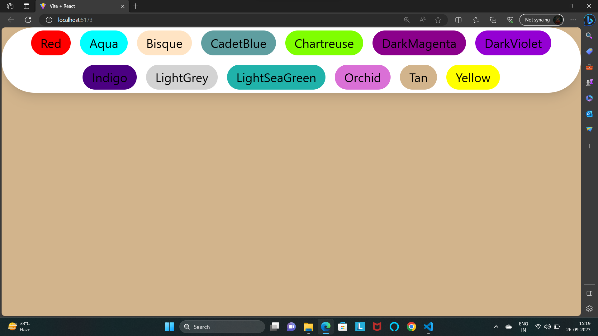
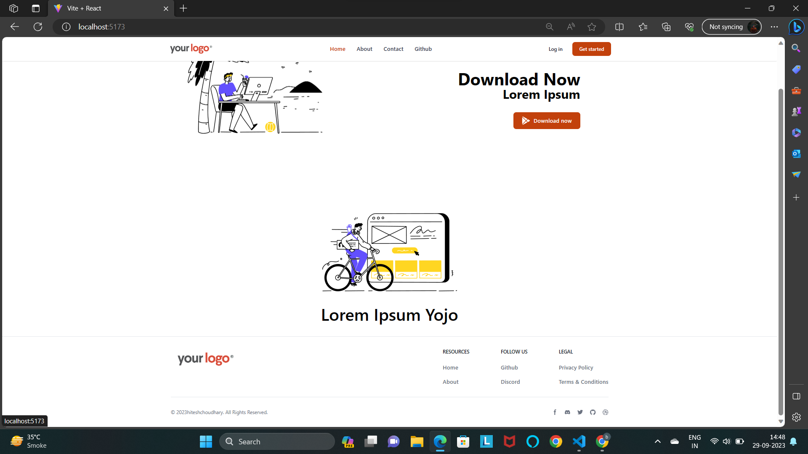
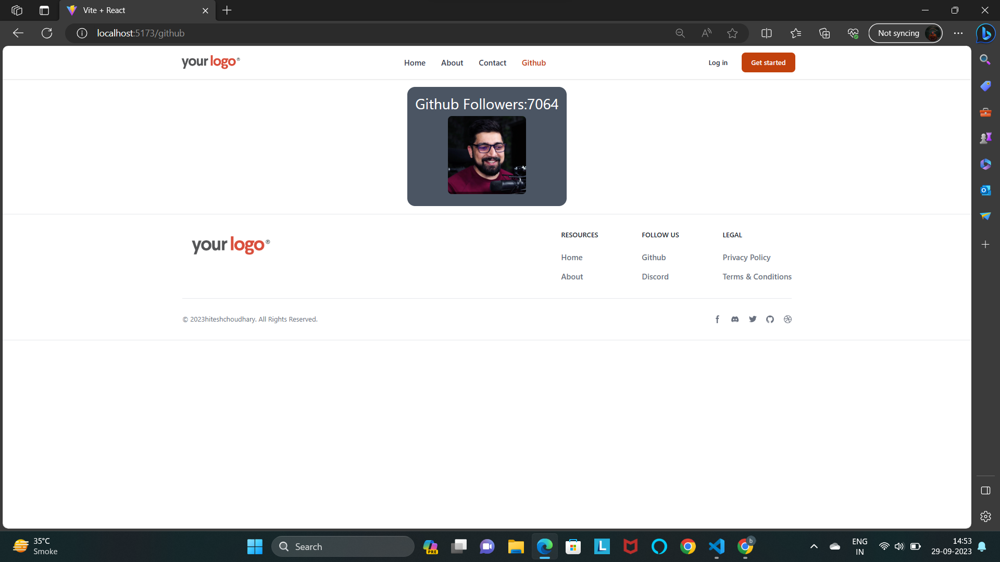

# React Notes

# 1. CUSTOM REACT


###  INDEX.HTML

```html
<!DOCTYPE html>
<html lang="en">
<head>
    <meta charset="UTF-8">
    <meta name="viewport" content="width=device-width, initial-scale=1.0">
    <title>Custom react</title>
</head>
<body>
    <div id="root"></div>
    <script src="./customreact.js"></script>
</body>
</html>
```


### CustomReact.js
```jsx
function customRender(reactElement, container){
/*
const domElement = document.createElement(reactElement.type)
domElement.innerHTML = reactElement.children
domElement.setAttribute('href', reactElement.props.href)
domElement.setAttribute('target', reactElement.props.terget)


container.appendChild(domElement)
*/
   const domElement = document.createElement(reactElement.type)
   domElement.innerHTML = reactElement.children
    for(const prop in reactElement.props) {
        if(prop === 'childern') continue;
        domElement.setAttribute(prop, reactElement.props[prop])
    }
    container.appendChild(domElement)
}
const reactElement = {
    type : 'a',
    props : {
        href : "https://google.com",
        terget : "_blank"
    },
    children : "Click me to visit google"
}
const mainContainer = document.getElementById("root");
customRender(reactElement, mainContainer)
```

# 2. HOOKS and projects
## Link : https://react.dev/reference/react

### App.js
```jsx
import { useState } from 'react' // 1st import hook.
import reactLogo from './assets/react.svg'
import viteLogo from '/vite.svg'
import './App.css'


function App() {
// make these Hook :
const [counter,setCounter] = useState(15);
// setCounter it short term as a function.
// let counter = 15;


 const addValue = ()=> {
  //  counter = counter + 1;
  //  if i was used to counter variable then it is show value are assign  but not UI show on react.
  // so this is a problem solve in Hooks.
  // console.log("clicked", Math.random());


  setCounter(counter + 1 );
 }
 const removeValue = () => {
  setCounter(counter - 1);
 }
  return (
    <>
      <h1>Marval Asssemble</h1>
      <h1>counter {counter}</h1>
      {/* pass only refrence of function not execute. */}
      <button onClick={addValue}>Add Values {counter}</button>
      <br /><br />
      {/* pass only refrence of function not execute. */}
      <button onClick={removeValue}>Remove Values {counter}</button>
      <h1>Footer : {counter}</h1>
    </>
  )
}

export default App
```

# 3. VIRTUAL DOM
- LINK : https://www.geeksforgeeks.org/reactjs-virtual-dom/
### What is Virtual DOM?
- > React uses Virtual DOM exists which is like a lightweight copy of the actual DOM(a virtual representation of the DOM). So for every object that exists in the original DOM, there is an object for that in React Virtual DOM. It is exactly the same, but it does not have the power to directly change the layout of the document. 

- > Manipulating DOM is slow, but manipulating Virtual DOM is fast as nothing gets drawn on the screen. So each time there is a change in the state of our application, the virtual DOM gets updated first instead of the real DOM. 
How does virtual DOM actually make things faster?
When anything new is added to the application, a virtual DOM is created and it is represented as a tree. Each element in the application is a node in this tree. So, whenever there is a change in the state of any element, a new Virtual DOM tree is created. This new Virtual DOM tree is then compared with the previous Virtual DOM tree and make a note of the changes. After this, it finds the best possible ways to make these changes to the real DOM. Now only the updated elements will get rendered on the page again.

### Reconciliation

- >The reconciliation process makes React work faster. Reconciliation is the process through which React updates the Browser DOM.  (1) Virtual DOM (2) Differentiation Algorithm.

Important concepts behind the working of the ReconciliatFiberion process are:
### Fiber
- React Fiber is a concept of ReactJS that is used to render a system faster and smoother. React is one of the popular JavaScript library used to create a responsive user interface. React makes coding simple as compared to other frameworks. After certain changes who is the next element to render the system called reconciler. This algorithm helps to compare two DOM trees and diff them. React fiber helps to do it better.


# 4. Tailwind and Props
### App.js
```jsx
import './App.css'
import Card from './component/Card'

function App() {

  const myObj = {
    userName : "dhinga",
    address : "Ranip, Ahmedabad"
  }

    const myArray = [1,2,3,4,5]

  return (
    <>
      <h1 className='bg-green-400 text-black p-4 rounded-xl '>Tailwind css with Vite + React.</h1>
      <Card userName = "Bman0" address="NikoL, Ahmedabad" />
      <Card userName = "Bhavesh" add ={myObj.address} decArray = {myArray} />
      <Card userName = "Dipali" address="paldi, Ahmedabad"/>
      <Card userName={myObj.userName} address={myObj.address} />

    </>
  )
}

export default App
```
### Card.jsx  inside of Components.
### Card.jsx 

```jsx
import React from "react"
// change the destructuring kare he props se sidha {userName} likate he aur extra variable add so on {userName, passWord}
function Card({userName,address="Outoff"}){
    // this 1st container props are empty.
    // so, value are given in App.js like declered as props.
    // <Card nickName = "Bman0" />
    // console.log(props.userName);  // if given props.
    // console.log(userName);
    return(
        <>
        <div className="md:flex bg-slate-100 rounded-xl p-8 md:p-0 dark:bg-slate-800 m-5">
        
        <div className="pt-6 md:p-8 text-center md:text-left space-y-4">
          <figcaption className="font-medium justify-between">
            {/* // declered userName is here. */}
            <div className="text-sky-500 dark:text-sky-400 text-4xl px-0 ">{userName}</div>
            <div className="text-slate-700 dark:text-slate-500 text-xl">{address}</div>
    {/* <div className="text-slate-700 dark:text-slate-500 text-xl">{address || "given Add"}</div> */}
          </figcaption>
        </div>
      </div>      
    </>     
   )
}
export default Card
```


# 5. React Interview Question on Counter
### App.js
```jsx
import './App.css'
import { useState } from 'react'


function App() {
  const [counter, setCounter] = useState(15)
  const addValue = () => {
   
    // setCounter( counter + 1)
    // setCounter( counter + 1)
    // setCounter( counter + 1)
    // setCounter( counter + 1)
    // setCounter( counter + 1)
    // react me jab bhi useState ka use karte vakt vo as banch (pura function 1) ki tarah trit karta he aur usme dekata he ki kiski value ko update karna he.
    // jab perform task duplicate milta he to use vo ignore karrta he ki use to mene kardiua.
    // jitne bhi setCounterr he usme 1 callback function exceppt karta he.
    // setCounter( () => {})


    setCounter( (preCounter) => preCounter + 1 )   // prevCounter jo last update he counter ki. jo vapas fatch karke magvai he.
    setCounter( (preCounter) => preCounter + 1 ) // jab call k throught ata he tab vo pura complite ho k ata he..
    setCounter( (preCounter) => preCounter + 1 ) // this is a 1 type of propogate.. // ye bunch of packets nahi he.. previous state le rahe ho.
  }
  const removeValue = () => {
    setCounter( counter - 1 )
  }
  return (
    <>
     <h1>React + Vite</h1>
     <h2>Counter Update {counter} </h2>
     <br />
     <button onClick={addValue}>Add Values</button>
     <br /><br />
     <button onClick={removeValue}> Remove Values</button>
    </>
  )
}
export default App
```
# 6. BG Changer
### App.js
```jsx
import { useState } from "react"


function App() {
  const [color, setColor] = useState("olive");

  return (
	// difine variable in color if backgroundColor
    <div className="w-full h-screen duration-100 " style={{ backgroundColor: color }}>
      <div className="fixed flex flex-wrap justify-center bottom-12 inset-x-0 px-2">
        <div className="fixed flex flex-wrap justify-center gap-3 shadow-lg bg-white px-3 py-1 rounded-full">

          <button className="outline-none px-3 py-1 rounded-full" style={{background: "red"}} onClick={() => setColor("red")}>Red</button>

          {/* onClick it is a pass a call back function not expext a return value as expext a give me a function.
          so expext these if, onClick ={setColor}  this is a pass refrence of function par parameter can't pass them.
          if parameter pass so onClick={setColor("red")} so problem of syntax.
          but, these are directly execute is onClick={setColor("red")} tab fuction jo return value dega vo function me chala jaiga.
          onClick ko sirf function chahiyee.. not retun value them pass
          so pass onClick = { () => setColor("red")} pass as callback function  */}

          <button className="outline-none px-3 py-1 rounded-full" style={{background: "Aqua"}} onClick={() => setColor("Aqua")} >Aqua</button>
          <button className="outline-none px-3 py-1 rounded-full" style={{background: "Bisque"}} onClick={() => setColor("Bisque")}>Bisque</button>
          <button className="outline-none px-3 py-1 rounded-full" style={{background: "CadetBlue"}} onClick={() => setColor("CadetBlue")}>CadetBlue</button>
          <button className="outline-none px-3 py-1 rounded-full" style={{background: "Chartreuse"}} onClick={() => setColor("Chartreuse")}>Chartreuse</button>
          <button className="outline-none px-3 py-1 rounded-full" style={{background: "DarkMagenta"}} onClick={() => setColor("DarkMagenta")}>DarkMagenta</button>
          <button className="outline-none px-3 py-1 rounded-full" style={{background: "DarkViolet"}} onClick={() => setColor("DarkViolet")}>DarkViolet</button>
          <button className="outline-none px-3 py-1 rounded-full" style={{background: "Indigo"}} onClick={() => setColor("Indigo")}>Indigo</button>
          <button className="outline-none px-3 py-1 rounded-full" style={{background: "LightGrey"}} onClick={()=> setColor("Indigo")}>Indigo</button> 
        </div>
      </div>
    </div>
  )
}
export default App

```



## auto Change Background
```jsx 
import { useEffect, useState } from "react";

function App() {
  const [color, setColor] = useState("olive");
  const [autoChange, setAutoChange] = useState(false); // Flag to control automatic color change

  // Function to generate a random color
  const generateRandomColor = () => {
    return '#' + Math.floor(Math.random() * 16777215).toString(16);
  };

  // Function to handle the Start/Stop button click
  const handleToggleClick = () => {
    setAutoChange(!autoChange); // Toggle the autoChange state
  };

  // Use useEffect to change the background color automatically when autoChange is true
  useEffect(() => {
    let intervalId;

    if (autoChange) {
      intervalId = setInterval(() => {
        const randomColor = generateRandomColor();
        setColor(randomColor);
      }, 1000); // Change color every 1000 milliseconds (1 second)
    }

    // Clean up the interval when autoChange is false or when the component unmounts
    return () => 
    clearInterval(intervalId);

  }, [ handleToggleClick]);

  return (

    <div className="w-full h-screen duration-100 " style={{ backgroundColor: color }}>
      <div className="fixed flex flex-wrap justify-center inset-x-0 px-2">
        <div className="fixed flex flex-wrap justify-center gap-3 shadow-lg bg-white px-3 py-1 rounded-full">

          {/* onClick it is a pass a call back function not expext a return value as expext a give me a function.
          so expext these if, onClick ={setColor}  this is a pass refrence of function par parameter can't pass them. 
          if parameter pass so onClick={setColor("red")} so problem of syntax.
          but, these are directly execute is onClick={setColor("red")} tab fuction jo return value dega vo function me chala jaiga.
          onClick ko sirf function chahiyee.. not retun value them pass
          so pass onClick = { () => setColor("red")} pass as callback function  */}

          <button className="outline-none px-3 py-1 rounded-full" style={{background: "red"}} onClick={() => setColor("red")}>Red</button>
          <button className="outline-none px-3 py-1 rounded-full" style={{background: "Aqua"}} onClick={() => setColor("Aqua")} >Aqua</button>
          <button className="outline-none px-3 py-1 rounded-full" style={{background: "Bisque"}} onClick={() => setColor("Bisque")}>Bisque</button>
          <button className="outline-none px-3 py-1 rounded-full" style={{background: "CadetBlue"}} onClick={() => setColor("CadetBlue")}>CadetBlue</button>
          <button className="outline-none px-3 py-1 rounded-full" style={{background: "Chartreuse"}} onClick={() => setColor("Chartreuse")}>Chartreuse</button>
          <button className="outline-none px-3 py-1 rounded-full" style={{background: "DarkMagenta"}} onClick={() => setColor("DarkMagenta")}>DarkMagenta</button>
          <button className="outline-none px-3 py-1 rounded-full" style={{background: "DarkViolet"}} onClick={() => setColor("DarkViolet")}>DarkViolet</button>
          <button className="outline-none px-3 py-1 rounded-full" style={{background: "Indigo"}} onClick={() => setColor("Indigo")}>Indigo</button>
          <button className="outline-none px-3 py-1 rounded-full" style={{background: "LightGrey"}} onClick={() => setColor("LightGrey")}>LightGrey</button>
          <button className="outline-none px-3 py-1 rounded-full" style={{background: "LightSeaGreen"}} onClick={() => setColor("LightSeaGreen")}>LightSeaGreen</button>
          <button className="outline-none px-3 py-1 rounded-full" style={{background: "Orchid"}} onClick={() => setColor("Orchid")}>Orchid</button>
          <button className="outline-none px-3 py-1 rounded-full" style={{background: "Tan"}} onClick={() => setColor("Tan")}>Tan</button>
          <button className="outline-none px-3 py-1 rounded-full" style={{background: "Yellow"}} onClick={() => setColor("Yellow")}>Yellow</button>
          <button className="outline-none px-3 py-1 rounded-full" style={{background: "Yellow"}} onClick={handleToggleClick}>
          {autoChange ? 'Stop' : 'Start'}
          Auto Change</button>

        </div>
      </div>
    </div>
  )
}

export default App

```


*******************************************************************
***
# 7. Password Generator

## Introduction of More Hooks.

### useCallback : useCallback(fn, dependency), useCallback( fn, [])
[link : useCallback](https://react.dev/reference/react/useCallback)
### useEffect : useEffect(fn, dependency), useEffect(fn, []) 
[link : useEffect](https://react.dev/reference/react/useEffect)
### useRef : useRef()
[link : useRef](https://react.dev/reference/react/useRef)

## useCallback(fn, dependency), useCallback( fn, [])
- > jo har ek dependency ko catch(memory) me store kar k rakhata he jo bar bar change ho ne par re-rendring hota he.
- >  general perpose for a optimization.
   const passwordGenerator = useCallback(fn , []);    // fu = callback function.
- > goal only optimization. and catch(memory) me rako does not run . this is a function defination not run.

## useEffect(fn, dependency), useEffect(fn, []) 
- > goal only for target change hone par run hota he. it means effect then called a use effect run .

## useRef : useRef()
- >   only one time run not take simuntainiously run useCallback() only store memory( catch);


##
## App.jsx
```jsx
import { useCallback, useState, useEffect, useRef } from 'react'

function App() {
  const [length, setLength] = useState(15)
  const [numAllowed, setNumAllowed] = useState(false);
  const [checkAllowed, setCheckAllowed] = useState(false);
  const [password, setPassword] = useState("")
  const [rangeCopy, setRangeCopy] = useState(10);

  // ********************************* useCallback(fn, dependency) *********************************** 
  // jo har ek dependency ko catch(memory) me store kar k rakhata he jo bar bar change ho ne par re-rendring hota he.
  // general perpose for a optimization.
  // const passwordGenerator = useCallback(fn , []);    // fu = callback function.
  // goal only optimization. and catch(memory) me rako does not run . this is a function ddefination not run.

  const passwordGenerator = useCallback(() => {

    let pass = ""; // generated password bana kar use setpassword me pass kar k password me bhej denge.
    let str = "ABCDEFGHIJKLMNOPQRSTUVWXYZabcdefghijklmanopqrstuvwxyz" // jisme data aiga jisse password banega.

    if (numAllowed) str += "0123456789" // jab number allowed ho tab string ko add update(add) kar do.

    if (checkAllowed) str += "`~!@#$%^&*()_{}:<>?/.,';][\|" // jab character allowed he tab string update(add) kardo.


    // ab kitanaa loop chalega vo govern karta he length. as string length....

    for (let i = 1; i <= length; i++) {
      let char = Math.floor(Math.random() * str.length + 1); // yhan par character ki random length ai he. not a value of charecter inside. cheracter ko uthana padega he random vslues me se.
      pass += str.charAt(char);   // jese loop finish hoga tab value pass ho jaigi pass(blank string) me. += not declered then values are override.
      // value add but never read 
    }

    setPassword(pass)
    // if this declered then read inside pass char value.

  }, [length, numAllowed, checkAllowed, setPassword,setRangeCopy]); // setPassword is a method these dependency if chang password. 
  // setPassword concept of memoization. 1 method de do jisme value set ho rahi he. only perpose of optimization.
  // if declered password then infinite loop inside password where use.

  // passwordGenerator(); // this is a declered outside then generate Problem.  infinite re-rendring 


  // ***************************** useRef() *************************************
  const passwordRef = useRef(null);

  // only one time run not take simuntainiously run useCallback() only store memory(catch);
  const copyPasswordToClipboard = useCallback(() => {
    window.navigator.clipboard.writeText(password)
    passwordRef.current?.select()
    passwordRef.current?.setSelectionRange(0,rangeCopy);
  }, [password,rangeCopy])


  // ********************************* useEffect(fn, dependancy) *************************************************
  // goal only run cahnge hone par run hota he. it means effect then called a use effect run .
  // useEffect(fn, [])
  useEffect(() => {
    passwordGenerator();
  }, [length, checkAllowed, numAllowed, passwordGenerator, setPassword])


  return (
    <>
      <div className=' text-center text-white bg-slate-700 w-full max-w-md mx-auto shadow-md rounded-lg py-3 px-3 my-10'>

        <h1 className="text-4xl font-bold" >Password Generator</h1><br />
        <div className='className="flex  rounded-lg overflow-hidden mb-4'>
          <input
            type="text"
            value={password} // jo hammane state k ander set karke rakhi he.
            className="outline-none py-1  px-2 w-80  rounded-lg text-black"
            placeholder="Password"
            readOnly  // taki koi write na kar pai ye.
            ref={passwordRef}
          />
          <button
            onClick={copyPasswordToClipboard}
            className="outline-none bg-indigo-500 mx-2 px-2 py-1 top-0 shrink-0 rounded-md drop-shadow-md">
            Copy</button>

        </div>

        <div className='flex text-sm gap-x-5 text-indigo-300 font-normal'>
          <div className='flex items-center gap-x-2 px-3'>
            <input type="range"
              min={6} max={100}
              value={length} // jo link hamare state se jisme length definr kiyahe.
              className='cursor-pointer accent-blue-500'
              onChange={(e) => { setLength(e.target.value) }} // jb onChange hota he tab fire karna padta he e(event) ko  jo change hota he.  jab event pass karte he tab vo call karta he setLength property ko. jo target karata he value ko. tab state k ander value change ho gi.
            />
            <label>
              {/* this ia adefault value pass a state on length  */}
              Length: {length}
            </label>
          </div>
          <div className='flex items-center gap-x-1'>
            <input
              type="checkbox"
              className='cursor-pointer accent-blue-500'
              defaultChecked={numAllowed}
              id='numberInput' // not necessary
              onChange={() => { setNumAllowed((prev) => !prev) }}  //callback fire. prev value se reverse value kar do. job prev true tab false or toggel.
            />
            <label>Numbers</label>
          </div>
          <div className='flex items-center gap-x-1'>
            <input
              type="checkbox"
              defaultChecked={checkAllowed}
              id='numberInput' // not necessary
              className='cursor-pointer accent-blue-500'
              onChange={() => { setCheckAllowed((prev) => !prev) }}  //callback fire. prev value se reverse value kar do. job prev true tab false or toggel.
            // jab setCheckAllowed(true) karte tab vo har bar hi true rahega toggle nahi ho paiga check mark update hoga.

            />
            <label>Character</label>
          </div>

        </div>

        <div className='flex items-center gap-x-1 text-indigo-300 my-2 mx-3 '>
          <input
            input type="range"
            value={rangeCopy}
            onChange={(e) => {setRangeCopy(e.target.value)}}
            min={6} max={50}
            className='cursor-pointer accent-blue-500'
          />
          <label htmlFor="copyRange">Copy Range: {rangeCopy}</label>
        </div>

      </div>
    </>
  )
}

export default App

```
### Output


***
***

# 8. CUSTOM HOOKS
## PROJECT :  CURRENCY CONVERTER
### App.jsx

```jsx
import { useState } from "react";
import InputBox from "./component/InputBox";
import useCurrencyInfo from "./customHook/useCurrencyInfo"


function App() {
    const [amount, setAmount] = useState(0)
    const [from, setFrom] = useState("usd")
    const [to, setTo] = useState("inr")
    const [convertedAmout, setConvertedAmount] = useState(0)

    const [selectedFromCurrency, setSelectedFromCurrency] = useState(from);
    const [selectedToCurrency, setSelectedToCurrency] = useState(to);

    const currencyInfo = useCurrencyInfo(from)
    const option = Object.keys(currencyInfo)

    const swap = () => {
        setFrom(to)
        setTo(from)
        setConvertedAmount(amount)
        setAmount(convertedAmout)

        // Update the selected currencies when swapping
        setSelectedFromCurrency(to);
        setSelectedToCurrency(from);

    }
    
    const convert = () => {
        setConvertedAmount(amount * currencyInfo[to])
    }

     // Define a function to reset the form fields to their initial values
  const resetForm = () => {
    setAmount(0);
    setSelectedFromCurrency("usd");
    setSelectedToCurrency("inr");
    setConvertedAmount(0);
  }


  return (
      <>
        <div
            className="w-full h-screen flex flex-wrap justify-center items-center bg-cover bg-no-repeat"
            style={{
                backgroundImage: `url('https://images.pexels.com/photos/3532540/pexels-photo-3532540.jpeg?auto=compress&cs=tinysrgb&w=1260&h=750&dpr=2')`,
            }}
        >
            <div className="w-full">
                <div className="w-full max-w-md mx-auto border border-gray-60 rounded-lg p-5 backdrop-blur-sm bg-white/30">
                    <form
                        onSubmit={(e) => {
                            e.preventDefault();
                            convert()
                        }}
                    >
                        <div className="w-full mb-1">
                         <InputBox
                         label="from"
                         amount={amount}
                         currencyOption={option}
                         onCurrencyChange={(currency) => setSelectedFromCurrency(currency) }
                         onAmountChange={ (amount) => setAmount(amount) }
                         selectCurrency={selectedFromCurrency} // Use selectedFromCurrency
                          />
                        </div>
                        <div className="relative w-full h-0.5">
                            <button
                                type="button"
                                className="absolute left-1/2 -translate-x-1/2 -translate-y-1/2 border-2 border-white rounded-md bg-blue-600 text-white px-2 py-0.5"
                                onClick={swap}
                            >
                                swap
                            </button>
                        </div>
                        <div className="w-full mt-1 mb-4">
                        <InputBox
                         label="to"
                         amount={convertedAmout}
                         currencyOption={option}
                         onCurrencyChange={(currency) => setSelectedToCurrency(currency)}
                         selectCurrency={selectedToCurrency} // Use selectedToCurrency
                         amountDisable
                          />
                        </div>
                        <button type="submit" className="w-full bg-blue-600 text-white px-4 py-3 rounded-lg">
                            Convert {selectedFromCurrency.toUpperCase()} to {selectedToCurrency.toLowerCase()}
                        </button>
                        <button type="button" onClick={resetForm} className="w-full bg-red-500 text-white px-4 py-3 my-2 rounded-lg" >
                            Reset 
                            </button>
                    </form>
                </div>
            </div>
        </div>
      </>
  );

 }

 export default App

``` 

## CUSTOM HOOK FILE:
### File Path: customHook/useCurrencyInfo.js
### useCurrencyInfo.js
```jsx
import { useEffect, useState } from "react";

// Custom Hook 
// function Hello(){
//     return []
// }
// Api URL for currency rate converter :
// let url = `https://cdn.jsdelivr.net/gh/fawazahmed0/currency-api@1/latest/currencies/${currency}.json`
// jab pura data milta he tab jo string form me hotahee most of cases me so typeof check .
// so, convert String to Json Conver.


function useCurrencyInfo(currency){
    // jab koi component mount hota he uska life cycle method run hota he tab useEffect(() => {}, []).
        const[data, setData] = useState({});

        useEffect( () => {
            fetch(`https://cdn.jsdelivr.net/gh/fawazahmed0/currency-api@1/latest/currencies/${currency}.json`)
            .then((res) => res.json())
            .then((res) => setData(res[currency]) ) // res[currency] === res.currency
            console.log(data);
        }, [currency])
        console.log(data);
    return data;
}

export default useCurrencyInfo;

```

## component
- InputBox.jsx
- Index.jsx

### Index.jsx
File Path : component/Input.jsx
```jsx
import React, {useId} from 'react'


function InputBox({
  label,
  amount,
  onAmountChange,
  onCurrencyChange,
  currencyOption = [],
  selectCurrency = "usd",
  amountDisable = false,
  currencyDisable = false,  
  className = "",
}) {
 
const amountInputId = useId();
  return (

      <div className={`bg-white p-3 rounded-lg text-sm flex ${className}`}>
          <div className="w-1/2">
              <label  
              htmlFor={amountInputId}
                //  this is a biding of useId hook.
              className="text-black/40 mb-2 inline-block">
                  {label}
              </label>
              <input
                  id={amountInputId}
                  className="outline-none w-full bg-transparent py-1.5 px-2 bg-blue-200 rounded-sm"
                  type="number"
                  placeholder="Amount"
                  disabled = {amountDisable}
                  value={amount}
                  onChange={(e) => onAmountChange && onAmountChange(Number(e.target.value)) } // stricly check.
                  // onAmountChange event fire karna  ho sakta he onAmountChange me koi value na ho tab check karne k liye && call kar diya jo aur vo string format me hone oar value change karni padti hee.
              />
          </div>
          <div className="w-1/2 flex flex-wrap justify-end text-right">
              <p className="text-black/40 mb-2 w-full">Currency Type</p>
              <select
                  className="rounded-lg px-1 py-1 bg-gray-100 cursor-pointer outline-none"
                  value={selectCurrency}
                  onChange={(e) => onCurrencyChange && onCurrencyChange(e.target.value)}
                  disabled = {currencyDisable}
                  
              >
                  
                  {
                    currencyOption.map( (currency) => (

                      <option key={currency} value={currency}>
                          {currency}
                      </option>
                    ) )
                  }
              
              </select>
          </div>
      </div>
  );
}

export default InputBox;

```

## Index.js
### File Path : component/Index.jsx
```jsx
import InputBox from "./InputBox"; 

export {InputBox}
```
### result :


*** 
***


# React Router
## Link : https://reactrouter.com/en/main
### Install React route in Given Project how to to install step in link.

## Project:
### File Structure:
### src
   - ### component
     - Header
       - Header.jsx 
     - Footer
       - Footer.jsx
     - Home
       - Home.jsx
     - About
       - About.jsx
     - User
       - User.jsx
     - Contact
       - Contact.jsx
     - Github
       - Github.jsx
  - Layout.jsx
  - main.jsx

## main.jsx
```jsx
import React from 'reat'
import ReactDOM from 'react-dom/client'
import App from './App.jsx'
import './index.css'
import { Route, RouterProvider, createBrowserRouter, createRoutesFromElements } from 'react-router-dom'
import Layout from './Layout.jsx'
import Home from './component/Home/Home.jsx'
import About from './component/About/About.jsx'
import Contact from './component/Contact/Contact.jsx'
import { createRef } from 'react'
import User from './component/User/User.jsx'
import Githhub, { githubInfoLoader } from './component/Github/Githhub.jsx'

// 1st method
// const router = createBrowserRouter([
//   {
//     path: '/',
//     element: <Layout />,
//     children: [
//       {
//         path: "",
//         element: <Home />
//       },
//       {
//         path: "about",
//         element: <About />

//       },
//       {
//         path: "contact",
//         element: <Contact />

//       }
//     ]
//   }
// ])

// 2nd easy method
const router = createBrowserRouter(
  createRoutesFromElements(
    <Route path="/" element={<Layout />}>
      <Route path="" element={<Home />} />
      <Route path="about" element={<About />} />
      <Route path="contact" element={<Contact />} />
      <Route path="user/:userid" element={<User />} />
      <Route
       loader={githubInfoLoader}
       path="github"
       element={<Githhub />}
      />
    </Route>
  )
)

ReactDOM.createRoot(document.getElementById('root')).render(
  <React.StrictMode>
    <RouterProvider router={router} />
  </React.StrictMode>,
)
```
## Layout.jsx
```jsx
import React from 'react'
import Header from './component/Header/Header'
import Footer from './component/Footer/Footer'
import { Outlet } from 'react-router-dom'
// jo header and footer ko at it is rakhata he or home bich ka layout ko change karta he. 
// jahan outlet diya van iteams ko change kar dega.

function Layout() {
  return (
    <>
    <Header />
    <Outlet />
    <Footer />
    </>
  )
}

export default Layout
```

## component
### Header/ Header.jsx 
```jsx
import React from 'react'
import {Link, NavLink} from 'react-router-dom'

// link use for replaced by <a> tag because if you use <a> tage then refress to the page so used to Link. 
// Navlink : Note that we are passing a function to className. When the user is at the URL in the NavLink, then isActive will be true. When it's about to be active (the data is still loading) then isPending will be true. This allows us to easily indicate where the user is, as well as provide immediate feedback on links that have been clicked but we're still waiting for data to load.

export default function Header() {
    return (
        <header className="shadow sticky z-50 top-0">
            <nav className="bg-white border-gray-200 px-4 lg:px-6 py-2.5">
                <div className="flex flex-wrap justify-between items-center mx-auto max-w-screen-xl">
                    <Link to="/" className="flex items-center">
                        
                    </Link>
                    <div className="flex items-center lg:order-2">
                        <Link
                            to="#"
                            className="text-gray-800 hover:bg-gray-50 focus:ring-4 focus:ring-gray-300 font-medium rounded-lg text-sm px-4 lg:px-5 py-2 lg:py-2.5 mr-2 focus:outline-none"
                        >
                            Log in
                        </Link>
                        <Link
                            to="#"
                            className="text-white bg-orange-700 hover:bg-orange-800 focus:ring-4 focus:ring-orange-300 font-medium rounded-lg text-sm px-4 lg:px-5 py-2 lg:py-2.5 mr-2 focus:outline-none"
                        >
                            Get started
                        </Link>
                    </div>
                    <div
                        className="hidden justify-between items-center w-full lg:flex lg:w-auto lg:order-1"
                        id="mobile-menu-2"
                    >
                        <ul className="flex flex-col mt-4 font-medium lg:flex-row lg:space-x-8 lg:mt-0">
                            <li>
                                <NavLink
                                    to="/"
                                    className={({isActive}) =>
                                        `block py-2 pr-4 pl-3 duration-200 ${ isActive ? "text-orange-700" : "text-gray-700"} border-b border-gray-100 hover:bg-gray-50 lg:hover:bg-transparent lg:border-0 hover:text-orange-700 lg:p-0`
                                    }
                                >
                                    Home
                                </NavLink>
                            </li>
                            <li>
                                <NavLink
                                    to="/about"
                                    className={({isActive}) =>
                                        `block py-2 pr-4 pl-3 duration-200 ${ isActive ? "text-orange-700" : "text-gray-700"} border-b border-gray-100 hover:bg-gray-50 lg:hover:bg-transparent lg:border-0 hover:text-orange-700 lg:p-0`
                                    }
                                >
                                    About
                                </NavLink>
                            </li>
                            <li>
                                <NavLink
                                    to="/contact"
                                    className={({isActive}) =>
                                        `block py-2 pr-4 pl-3 duration-200 ${ isActive ? "text-orange-700" : "text-gray-700"} border-b border-gray-100 hover:bg-gray-50 lg:hover:bg-transparent lg:border-0 hover:text-orange-700 lg:p-0`
                                    }
                                >
                                    Contact
                                </NavLink>
                            </li>
                            <li>
                                <NavLink
                                    to="/github"
                                    className={({isActive}) =>
                                        `block py-2 pr-4 pl-3 duration-200 ${ isActive ? "text-orange-700" : "text-gray-700"} border-b border-gray-100 hover:bg-gray-50 lg:hover:bg-transparent lg:border-0 hover:text-orange-700 lg:p-0`
                                    }
                                >
                                    Github
                                </NavLink>
                            </li>
                            
                        </ul>
                    </div>
                </div>
            </nav>
        </header>
    );
}

```

## Footer/ Footer.jsx
```jsx
import React from 'react'
import {Link} from 'react-router-dom'

export default function Footer() {
    return (
        <footer className="bg-white border-y">
            <div className="mx-auto w-full max-w-screen-xl p-4 py-6 lg:py-8">
                <div className="md:flex md:justify-between">
                    <div className="mb-6 md:mb-0">
                        <Link to="/" className="flex items-center">
                            
                        </Link>
                    </div>
                    <div className="grid grid-cols-2 gap-8 sm:gap-6 sm:grid-cols-3">
                        <div>
                            <h2 className="mb-6 text-sm font-semibold text-gray-900 uppercase">Resources</h2>
                            <ul className="text-gray-500 font-medium">
                                <li className="mb-4">
                                    <Link to="/" className="hover:underline">
                                        Home
                                    </Link>
                                </li>
                                <li>
                                    <Link to="/about" className="hover:underline">
                                        About
                                    </Link>
                                </li>
                            </ul>
                        </div>
                        <div>
                            <h2 className="mb-6 text-sm font-semibold text-gray-900 uppercase">Follow us</h2>
                            <ul className="text-gray-500 font-medium">
                                <li className="mb-4">
                                    <a
                                        href="https://github.com/hiteshchoudhary"
                                        className="hover:underline"
                                        target="_blank"
                                        rel="noreferrer"
                                    >
                                        Github
                                    </a>
                                </li>
                                <li>
                                    <Link to="/" className="hover:underline">
                                        Discord
                                    </Link>
                                </li>
                            </ul>
                        </div>
                        <div>
                            <h2 className="mb-6 text-sm font-semibold text-gray-900 uppercase">Legal</h2>
                            <ul className="text-gray-500 font-medium">
                                <li className="mb-4">
                                    <Link to="#" className="hover:underline">
                                        Privacy Policy
                                    </Link>
                                </li>
                                <li>
                                    <Link to="#" className="hover:underline">
                                        Terms &amp; Conditions
                                    </Link>
                                </li>
                            </ul>
                        </div>
                    </div>
                </div>
                <hr className="my-6 border-gray-200 sm:mx-auto lg:my-8" />
                <div className="sm:flex sm:items-center sm:justify-between">
                    <span className="text-sm text-gray-500 sm:text-center">
                        © 2023
                        <a href="https://hiteshchoudhary.com/" className="hover:underline">
                            hiteshchoudhary
                        </a>
                        . All Rights Reserved.
                    </span>
                    <div className="flex mt-4 space-x-5 sm:justify-center sm:mt-0">
                        <Link to="#" className="text-gray-500 hover:text-gray-900">
                            <svg
                                className="w-4 h-4"
                                aria-hidden="true"
                                xmlns="http://www.w3.org/2000/svg"
                                fill="currentColor"
                                viewBox="0 0 8 19"
                            >
                                <path
                                    fillRule="evenodd"
                                    d="M6.135 3H8V0H6.135a4.147 4.147 0 0 0-4.142 4.142V6H0v3h2v9.938h3V9h2.021l.592-3H5V3.591A.6.6 0 0 1 5.592 3h.543Z"
                                    clipRule="evenodd"
                                />
                            </svg>
                            <span className="sr-only">Facebook page</span>
                        </Link>
                        <Link to="#" className="text-gray-500">
                            <svg
                                className="w-4 h-4"
                                aria-hidden="true"
                                xmlns="http://www.w3.org/2000/svg"
                                fill="currentColor"
                                viewBox="0 0 21 16"
                            >
                                <path d="M16.942 1.556a16.3 16.3 0 0 0-4.126-1.3 12.04 12.04 0 0 0-.529 1.1 15.175 15.175 0 0 0-4.573 0 11.585 11.585 0 0 0-.535-1.1 16.274 16.274 0 0 0-4.129 1.3A17.392 17.392 0 0 0 .182 13.218a15.785 15.785 0 0 0 4.963 2.521c.41-.564.773-1.16 1.084-1.785a10.63 10.63 0 0 1-1.706-.83c.143-.106.283-.217.418-.33a11.664 11.664 0 0 0 10.118 0c.137.113.277.224.418.33-.544.328-1.116.606-1.71.832a12.52 12.52 0 0 0 1.084 1.785 16.46 16.46 0 0 0 5.064-2.595 17.286 17.286 0 0 0-2.973-11.59ZM6.678 10.813a1.941 1.941 0 0 1-1.8-2.045 1.93 1.93 0 0 1 1.8-2.047 1.919 1.919 0 0 1 1.8 2.047 1.93 1.93 0 0 1-1.8 2.045Zm6.644 0a1.94 1.94 0 0 1-1.8-2.045 1.93 1.93 0 0 1 1.8-2.047 1.918 1.918 0 0 1 1.8 2.047 1.93 1.93 0 0 1-1.8 2.045Z" />
                            </svg>
                            <span className="sr-only">Discord community</span>
                        </Link>
                        <Link to="#" className="text-gray-500">
                            <svg
                                className="w-4 h-4"
                                aria-hidden="true"
                                xmlns="http://www.w3.org/2000/svg"
                                fill="currentColor"
                                viewBox="0 0 20 17"
                            >
                                <path
                                    fillRule="evenodd"
                                    d="M20 1.892a8.178 8.178 0 0 1-2.355.635 4.074 4.074 0 0 0 1.8-2.235 8.344 8.344 0 0 1-2.605.98A4.13 4.13 0 0 0 13.85 0a4.068 4.068 0 0 0-4.1 4.038 4 4 0 0 0 .105.919A11.705 11.705 0 0 1 1.4.734a4.006 4.006 0 0 0 1.268 5.392 4.165 4.165 0 0 1-1.859-.5v.05A4.057 4.057 0 0 0 4.1 9.635a4.19 4.19 0 0 1-1.856.07 4.108 4.108 0 0 0 3.831 2.807A8.36 8.36 0 0 1 0 14.184 11.732 11.732 0 0 0 6.291 16 11.502 11.502 0 0 0 17.964 4.5c0-.177 0-.35-.012-.523A8.143 8.143 0 0 0 20 1.892Z"
                                    clipRule="evenodd"
                                />
                            </svg>
                            <span className="sr-only">Twitter page</span>
                        </Link>
                        <Link to="#" className="text-gray-500">
                            <svg
                                className="w-4 h-4"
                                aria-hidden="true"
                                xmlns="http://www.w3.org/2000/svg"
                                fill="currentColor"
                                viewBox="0 0 20 20"
                            >
                                <path
                                    fillRule="evenodd"
                                    d="M10 .333A9.911 9.911 0 0 0 6.866 19.65c.5.092.678-.215.678-.477 0-.237-.01-1.017-.014-1.845-2.757.6-3.338-1.169-3.338-1.169a2.627 2.627 0 0 0-1.1-1.451c-.9-.615.07-.6.07-.6a2.084 2.084 0 0 1 1.518 1.021 2.11 2.11 0 0 0 2.884.823c.044-.503.268-.973.63-1.325-2.2-.25-4.516-1.1-4.516-4.9A3.832 3.832 0 0 1 4.7 7.068a3.56 3.56 0 0 1 .095-2.623s.832-.266 2.726 1.016a9.409 9.409 0 0 1 4.962 0c1.89-1.282 2.717-1.016 2.717-1.016.366.83.402 1.768.1 2.623a3.827 3.827 0 0 1 1.02 2.659c0 3.807-2.319 4.644-4.525 4.889a2.366 2.366 0 0 1 .673 1.834c0 1.326-.012 2.394-.012 2.72 0 .263.18.572.681.475A9.911 9.911 0 0 0 10 .333Z"
                                    clipRule="evenodd"
                                />
                            </svg>
                            <span className="sr-only">GitHub account</span>
                        </Link>
                        <Link to="#" className="text-gray-500">
                            <svg
                                className="w-4 h-4"
                                aria-hidden="true"
                                xmlns="http://www.w3.org/2000/svg"
                                fill="currentColor"
                                viewBox="0 0 20 20"
                            >
                                <path
                                    fillRule="evenodd"
                                    d="M10 0a10 10 0 1 0 10 10A10.009 10.009 0 0 0 10 0Zm6.613 4.614a8.523 8.523 0 0 1 1.93 5.32 20.094 20.094 0 0 0-5.949-.274c-.059-.149-.122-.292-.184-.441a23.879 23.879 0 0 0-.566-1.239 11.41 11.41 0 0 0 4.769-3.366ZM8 1.707a8.821 8.821 0 0 1 2-.238 8.5 8.5 0 0 1 5.664 2.152 9.608 9.608 0 0 1-4.476 3.087A45.758 45.758 0 0 0 8 1.707ZM1.642 8.262a8.57 8.57 0 0 1 4.73-5.981A53.998 53.998 0 0 1 9.54 7.222a32.078 32.078 0 0 1-7.9 1.04h.002Zm2.01 7.46a8.51 8.51 0 0 1-2.2-5.707v-.262a31.64 31.64 0 0 0 8.777-1.219c.243.477.477.964.692 1.449-.114.032-.227.067-.336.1a13.569 13.569 0 0 0-6.942 5.636l.009.003ZM10 18.556a8.508 8.508 0 0 1-5.243-1.8 11.717 11.717 0 0 1 6.7-5.332.509.509 0 0 1 .055-.02 35.65 35.65 0 0 1 1.819 6.476 8.476 8.476 0 0 1-3.331.676Zm4.772-1.462A37.232 37.232 0 0 0 13.113 11a12.513 12.513 0 0 1 5.321.364 8.56 8.56 0 0 1-3.66 5.73h-.002Z"
                                    clipRule="evenodd"
                                />
                            </svg>
                            <span className="sr-only">Dribbble account</span>
                        </Link>
                    </div>
                </div>
            </div>
        </footer>
    );
}

```

### Home/ Home.jsx
```jsx
import React from 'react'
import {Link} from 'react-router-dom'

export default function Home() {
    return (
        <div className="mx-auto w-full max-w-7xl">
            <aside className="relative overflow-hidden text-black rounded-lg sm:mx-16 mx-2 sm:py-16">
                <div className="relative z-10 max-w-screen-xl px-4  pb-20 pt-10 sm:py-24 mx-auto sm:px-6 lg:px-8">
                    <div className="max-w-xl sm:mt-1 mt-80 space-y-8 text-center sm:text-right sm:ml-auto">
                        <h2 className="text-4xl font-bold sm:text-5xl">
                            Download Now
                            <span className="hidden sm:block text-4xl">Lorem Ipsum</span>
                        </h2>

                        <Link
                            className="inline-flex text-white items-center px-6 py-3 font-medium bg-orange-700 rounded-lg hover:opacity-75"
                            to="/"
                        >
                            <svg
                                fill="white"
                                width="24"
                                height="24"
                                xmlns="http://www.w3.org/2000/svg"
                                fillRule="evenodd"
                                clipRule="evenodd"
                            >
                                <path d="M1.571 23.664l10.531-10.501 3.712 3.701-12.519 6.941c-.476.264-1.059.26-1.532-.011l-.192-.13zm9.469-11.56l-10.04 10.011v-20.022l10.04 10.011zm6.274-4.137l4.905 2.719c.482.268.781.77.781 1.314s-.299 1.046-.781 1.314l-5.039 2.793-4.015-4.003 4.149-4.137zm-15.854-7.534c.09-.087.191-.163.303-.227.473-.271 1.056-.275 1.532-.011l12.653 7.015-3.846 3.835-10.642-10.612z" />
                            </svg>
                            &nbsp; Download now
                        </Link>
                    </div>
                </div>

                <div className="absolute inset-0 w-full sm:my-20 sm:pt-1 pt-12 h-full ">
                    
                </div>
            </aside>

            <div className="grid  place-items-center sm:mt-20">
                
            </div>

            <h1 className="text-center text-2xl sm:text-5xl py-10 font-medium">Lorem Ipsum Yojo</h1>
        </div>
    );
}

```


## About/ About.jsx
```jsx
import React from 'react'

export default function About() {
  return (
      <div className="py-16 bg-white">
          <div className="container m-auto px-6 text-gray-600 md:px-12 xl:px-6">
              <div className="space-y-6 md:space-y-0 md:flex md:gap-6 lg:items-center lg:gap-12">
                  <div className="md:5/12 lg:w-5/12">
                      
                  </div>
                  <div className="md:7/12 lg:w-6/12">
                      <h2 className="text-2xl text-gray-900 font-bold md:text-4xl">
                          React development is carried out by passionate developers
                      </h2>
                      <p className="mt-6 text-gray-600">
                          Lorem ipsum dolor, sit amet consectetur adipisicing elit. Eum omnis voluptatem
                          accusantium nemo perspiciatis delectus atque autem! Voluptatum tenetur beatae unde
                          aperiam, repellat expedita consequatur! Officiis id consequatur atque doloremque!
                      </p>
                      <p className="mt-4 text-gray-600">
                          Nobis minus voluptatibus pariatur dignissimos libero quaerat iure expedita at?
                          Asperiores nemo possimus nesciunt dicta veniam aspernatur quam mollitia.
                      </p>
                  </div>
              </div>
          </div>
      </div>
  );
}
```

## User/ User.jsx
```jsx
import React from 'react'
import { useParams } from 'react-router-dom'

function User() {
    const {userid} = useParams()
  return (
        <div className='flex flex-wrap justify-between items-center mx-auto max-w-screen-xl'>

        <div className='text-center bg-gray-700 text-white font-bold text-4xl w-full py-5'>User: {userid} </div>
    </div>
  )
}

export default User

```

## Contact/ Contact.jsx
```jsx
import React from 'react'

export default function Contact() {
    return (
        <div className="relative flex items-top justify-center min-h-[700px] bg-white sm:items-center sm:pt-0">
            <div className="max-w-6xl mx-auto sm:px-6 lg:px-8">
                <div className="mt-8 overflow-hidden">
                    <div className="grid grid-cols-1 md:grid-cols-2">
                        <div className="p-6 mr-2 bg-gray-100 sm:rounded-lg">
                            <h1 className="text-3xl sm:text-4xl text-gray-800 font-extrabold tracking-tight">
                                Get in touch: 
                            </h1>
                            <p className="text-normal text-lg sm:text-xl font-medium text-gray-600 mt-2">
                                Fill in the form to start a conversation
                            </p>

                            <div className="flex items-center mt-8 text-gray-600">
                                <svg
                                    fill="none"
                                    stroke="currentColor"
                                    strokeLinecap="round"
                                    strokeLinejoin="round"
                                    strokeWidth="1.5"
                                    viewBox="0 0 24 24"
                                    className="w-8 h-8 text-gray-500"
                                >
                                    <path
                                        strokeLinecap="round"
                                        strokeLinejoin="round"
                                        strokeWidth="1.5"
                                        d="M17.657 16.657L13.414 20.9a1.998 1.998 0 01-2.827 0l-4.244-4.243a8 8 0 1111.314 0z"
                                    />
                                    <path
                                        strokeLinecap="round"
                                        strokeLinejoin="round"
                                        strokeWidth="1.5"
                                        d="M15 11a3 3 0 11-6 0 3 3 0 016 0z"
                                    />
                                </svg>
                                <div className="ml-4 text-md tracking-wide font-semibold w-40">
                                    Acme Inc, Street, State, Postal Code
                                </div>
                            </div>

                            <div className="flex items-center mt-4 text-gray-600">
                                <svg
                                    fill="none"
                                    stroke="currentColor"
                                    strokeLinecap="round"
                                    strokeLinejoin="round"
                                    strokeWidth="1.5"
                                    viewBox="0 0 24 24"
                                    className="w-8 h-8 text-gray-500"
                                >
                                    <path
                                        strokeLinecap="round"
                                        strokeLinejoin="round"
                                        strokeWidth="1.5"
                                        d="M3 5a2 2 0 012-2h3.28a1 1 0 01.948.684l1.498 4.493a1 1 0 01-.502 1.21l-2.257 1.13a11.042 11.042 0 005.516 5.516l1.13-2.257a1 1 0 011.21-.502l4.493 1.498a1 1 0 01.684.949V19a2 2 0 01-2 2h-1C9.716 21 3 14.284 3 6V5z"
                                    />
                                </svg>
                                <div className="ml-4 text-md tracking-wide font-semibold w-40">
                                    +44 1234567890
                                </div>
                            </div>

                            <div className="flex items-center mt-2 text-gray-600">
                                <svg
                                    fill="none"
                                    stroke="currentColor"
                                    strokeLinecap="round"
                                    strokeLinejoin="round"
                                    strokeWidth="1.5"
                                    viewBox="0 0 24 24"
                                    className="w-8 h-8 text-gray-500"
                                >
                                    <path
                                        strokeLinecap="round"
                                        strokeLinejoin="round"
                                        strokeWidth="1.5"
                                        d="M3 8l7.89 5.26a2 2 0 002.22 0L21 8M5 19h14a2 2 0 002-2V7a2 2 0 00-2-2H5a2 2 0 00-2 2v10a2 2 0 002 2z"
                                    />
                                </svg>
                                <div className="ml-4 text-md tracking-wide font-semibold w-40">
                                    info@acme.org
                                </div>
                            </div>
                        </div>

                        <form className="p-6 flex flex-col justify-center">
                            <div className="flex flex-col">
                                <label htmlFor="name" className="hidden">
                                    Full Name
                                </label>
                                <input
                                    type="name"
                                    name="name"
                                    id="name"
                                    placeholder="Full Name"
                                    className="w-100 mt-2 py-3 px-3 rounded-lg bg-white border border-gray-400 text-gray-800 font-semibold focus:border-orange-500 focus:outline-none"
                                />
                            </div>

                            <div className="flex flex-col mt-2">
                                <label htmlFor="email" className="hidden">
                                    Email
                                </label>
                                <input
                                    type="email"
                                    name="email"
                                    id="email"
                                    placeholder="Email"
                                    className="w-100 mt-2 py-3 px-3 rounded-lg bg-white border border-gray-400 text-gray-800 font-semibold focus:border-orange-500 focus:outline-none"
                                />
                            </div>

                            <div className="flex flex-col mt-2">
                                <label htmlFor="tel" className="hidden">
                                    Number
                                </label>
                                <input
                                    type="tel"
                                    name="tel"
                                    id="tel"
                                    placeholder="Telephone Number"
                                    className="w-100 mt-2 py-3 px-3 rounded-lg bg-white border border-gray-400 text-gray-800 font-semibold focus:border-orange-500 focus:outline-none"
                                />
                            </div>

                            <button
                                type="submit"
                                className="md:w-32 bg-orange-700 hover:bg-blue-dark text-white font-bold py-3 px-6 rounded-lg mt-3 hover:bg-orange-600 transition ease-in-out duration-300"
                            >
                                Submit
                            </button>
                        </form>
                    </div>
                </div>
            </div>
        </div>
    );
}

```
### Github/ Github.jsx
```jsx
import React, { useEffect, useState } from 'react'
import { useLoaderData } from 'react-router-dom'

function Githhub() {

     const data =  useLoaderData()

    // const [data, setData] = useState([])

    // useEffect(() => {
    //     fetch('https://api.github.com/users/hiteshchoudhary')
    //         .then((response) => response.json())
    //         .then((data) => {
    //             console.log(data);
    //             setData(data)
    //         })
    // }, [])

    return (
        <div className='flex flex-wrap justify-center items-center mx-auto max-w-screen-xl rounded-lg'>
            <div className='text-center m-4 bg-gray-600 text-white p-4 text-3xl rounded-2xl '>Github Followers:{data.followers}
                
            </div>
        </div>
    )
}

export default Githhub

export const githubInfoLoader = async () => {

   const response =  await fetch('https://api.github.com/users/hiteshchoudhary')
    return response.json()

}
```




